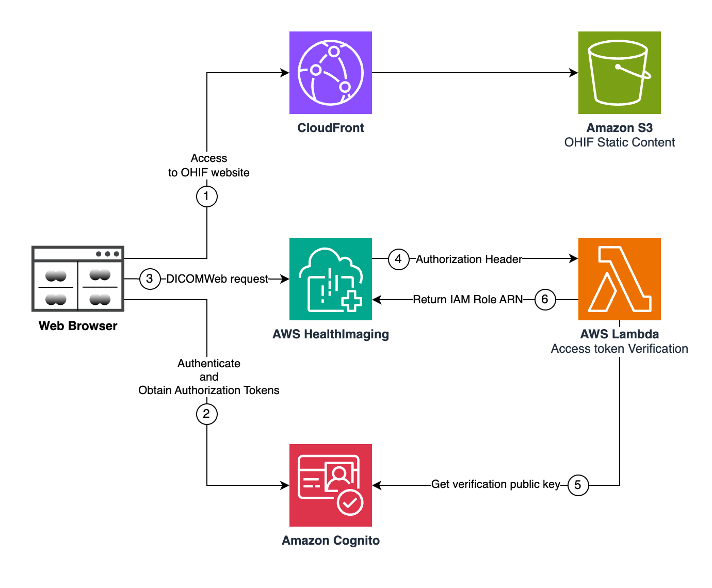

:warning: **README.md AI generated**: Information in this document was inferred from the code and may not be accurate.

# OHIF Medical Imaging Viewer with OIDC Authentication

A complete AWS CDK solution that deploys the OHIF (Open Health Imaging Foundation) medical imaging viewer with secure OIDC authentication, integrated with AWS HealthImaging for cloud-native DICOM storage and retrieval.

## 🏥 Overview

This solution provides a production-ready medical imaging platform that combines:

- **OHIF Viewer v3.11.0**: Modern web-based DICOM viewer with advanced imaging capabilities
- **OIDC Authentication**: Standards-based authentication using AWS Cognito
- **AWS HealthImaging**: Scalable, cloud-native DICOM storage with DICOMweb API compatibility
- **Automated CI/CD**: Complete infrastructure as code with automated OHIF compilation and deployment
- **Performance Optimization**: Lambda authorizer with provisioned concurrency for fast token validation

The architecture follows AWS best practices for security, scalability, and cost optimization while providing a seamless user experience for medical professionals.

## 🏗️ Architecture



### Architecture Flow

1. **User Access**: Users access the OHIF viewer through CloudFront distribution
2. **Authentication**: Cognito handles OIDC authentication and token issuance
3. **DICOM Requests**: OHIF makes DICOMweb API calls to AWS HealthImaging
4. **Authorization**: Lambda authorizer validates JWT tokens for each request, and returns 
5. **Token Verification**: Lambda retrieves Cognito public keys for JWT validation
6. **Data Access**: Lambda returns the ARN of the IAM Role for AHI to evaluate associated DICOMWeb privileges and provide the data to the client

## 🧱 Foundational Components

### Core Infrastructure
- **Amazon S3**: Hosts OHIF static web application with versioning and encryption
- **Amazon CloudFront**: Global CDN with Origin Access Control for secure content delivery
- **AWS Lambda**: Serverless authorizer function with provisioned concurrency (10 instances)
- **Amazon Cognito**: User pool and client for OIDC authentication with hosted UI

### Medical Imaging Stack
- **AWS HealthImaging**: DICOM datastore with integrated Lambda authorizer
- **IAM Roles**: Least-privilege access for HealthImaging read-only operations
- **Lambda Layers**: Optimized dependencies (boto3 1.40.31, python-jose, requests)

### CI/CD Pipeline
- **AWS CodeBuild**: Automated OHIF compilation with custom build specifications
- **Custom Resources**: Lambda functions for datastore creation and build triggering
- **S3 Artifacts**: Build artifacts storage with lifecycle management

## 📦 AWS Resources Created

### Compute & Serverless
- **3 Lambda Functions**:
  - OIDC Authorizer (with provisioned concurrency)
  - User Creation (for default admin)
  - Datastore Creation (custom resource)
  - Build Trigger (custom resource)
- **1 Lambda Version** with alias for blue/green deployments
- **2 Lambda Layers** for optimized dependencies

### Storage & Content Delivery
- **3 S3 Buckets**:
  - OHIF hosting bucket (encrypted, versioned)
  - Pipeline artifacts bucket (encrypted, versioned)
  - Build trigger bucket (temporary)
- **1 CloudFront Distribution** with Origin Access Control

### Security & Identity
- **1 Cognito User Pool** with email verification
- **1 Cognito User Pool Client** for OIDC flows
- **1 Cognito Domain** for hosted UI
- **4 IAM Roles**:
  - Lambda execution roles
  - CodeBuild service role
  - HealthImaging read-only role
  - Authorizer composite role

### Medical Imaging
- **1 AWS HealthImaging Datastore** with Lambda authorizer integration


### CI/CD & Monitoring
- **1 CodeBuild Project** for OHIF compilation
- **CloudWatch Log Groups** for all Lambda functions
- **Custom Resources** for deployment automation

### Networking & Permissions
- **Lambda Permissions** for HealthImaging service invocation
- **IAM Policies** with least-privilege access
- **S3 Bucket Policies** for secure access patterns


**Resource Naming Pattern**: Most resources include the stack name and account ID for uniqueness:
- Lambda functions: `ohif-oidc-authorizer-{stackname}-{account8digits}`
- IAM roles: `AHIDICOMWebReadOnlyRole-{stackname}-{account8digits}`
- Cognito domain: `ohif-{stackname}-{account8digits}`

### Region Configuration

```bash
# Deploy to specific region
export CDK_DEFAULT_REGION=us-west-2
npx cdk deploy

# Or use context
npx cdk deploy --context region=us-west-2
```

## ⚙️ Configuration

### Stack Name Configuration

The stack name is configurable by modifying the `userStackName` variable in `CDK/bin/ohif-oidc.ts`:

```typescript
// User-configurable stack name - modify this to change the stack name
const userStackName = 'OhifOidcStackV11';  // Change this value
```


## 🚀 Deployment

### Prerequisites

- **AWS CLI**: Configured with administrative permissions
- **Node.js**: Version 18.x or later
- **AWS CDK**: Version 2.87.0 or later
- **Docker or Podman**: Used by CDK to prepare deployment assets


### Install

```bash
# Navigate to CDK directory
cd CDK

# Install dependencies
npm install


# Deploy the stack
npx cdk deploy
```

### Deployment Process

1. **Infrastructure Creation** (5-10 minutes):
   - S3 buckets, CloudFront, Cognito, Lambda functions
   - IAM roles and policies
   - HealthImaging datastore with authorizer

2. **OHIF Compilation** (10-15 minutes):
   - Downloads OHIF v3.11.0 from GitHub
   - Applies AWS HealthImaging compatibility patches
   - Configures OIDC settings dynamically
   - Builds and deploys to S3
   - Creates CloudFront invalidation

3. **Final Configuration** (2-3 minutes):
   - Creates default admin user
   - Configures Lambda permissions
   - Validates deployment

**Total Deployment Time**: 15-25 minutes

### Post-Deployment Access

After successful deployment, the stack outputs provide:

```bash
# Key outputs from CDK deployment
OhifViewerUrl: https://d1234567890123.cloudfront.net
CognitoLoginUrl: https://ohif-stackname-12345678.auth.us-east-1.amazoncognito.com/login?...
DefaultAdminCredentials: Username: admin, Temporary Password: TempPass123!
HealthImagingDatastoreId: 12345678901234567890123456789012
```

### First Login

**Important**: Before accessing the OHIF viewer, wait for the CodeBuild project to complete (10-15 minutes after stack deployment).

#### Monitoring CodeBuild Progress

1. **AWS Console**: Navigate to AWS CodeBuild → Build projects → `ohif-oidc-build-{stackname}-{account}`
2. **Build History**: Check the latest build status (In Progress → Succeeded)
3. **Build Logs**: Click on the running build to view real-time logs

#### Access Steps

1. Wait for CodeBuild to show "Succeeded" status
2. Navigate to the `OhifViewerUrl`
3. Click "Login" to redirect to Cognito
4. Use credentials: `admin` / `TempPass123!`
5. **Change password immediately** when prompted
6. Complete profile information if required

## 🔧 Advanced Configuration

### Custom OHIF Version

Edit `lib/ohif-oidc-stack.ts` to change OHIF version:

```typescript
// Change this line in the buildSpec
'wget -O ohif.zip https://github.com/OHIF/Viewers/archive/refs/tags/v3.11.0.zip'
```

### Custom Build Configuration

Modify the CodeBuild buildSpec in the CDK stack to:
- Add custom OHIF extensions
- Modify build environment
- Add additional configuration steps
- Integrate with external systems

### Security Customization

```typescript
// Modify password policy
passwordPolicy: {
  minLength: 12,
  requireLowercase: true,
  requireUppercase: true,
  requireDigits: true,
  requireSymbols: true
}

// Adjust token validity
accessTokenValidity: cdk.Duration.hours(2),
idTokenValidity: cdk.Duration.hours(2)
```

## 🔐 Security Features

- **HTTPS Everywhere**: All communication encrypted in transit
- **Origin Access Control**: S3 bucket accessible only through CloudFront
- **JWT Validation**: Cryptographic token verification with public key validation
- **IAM Least Privilege**: Minimal permissions for all resources
- **Encryption at Rest**: S3 buckets encrypted with AWS managed keys


## 🔄 Maintenance & Updates

### Stack Updates

```bash
# Preview changes
npx cdk diff

# Deploy updates
npx cdk deploy

# Force rebuild OHIF
aws codebuild start-build --project-name ohif-oidc-build-{stackname}-{account}
```

## 📚 Additional Resources

- [AWS HealthImaging Documentation](https://docs.aws.amazon.com/healthimaging/)
- [OHIF Documentation](https://docs.ohif.org/)
- [AWS CDK Documentation](https://docs.aws.amazon.com/cdk/)
- [Cognito OIDC Documentation](https://docs.aws.amazon.com/cognito/latest/developerguide/cognito-user-pools-oidc-idp.html)

## 🤝 Contributing

This project follows infrastructure as code principles. All changes should be:
1. Tested locally with `npx cdk diff`
2. Documented in this README
3. Validated with deployment testing
4. Reviewed for security implications

## 📄 License

This project is licensed under the MIT License. See the [LICENSE](LICENSE) file for details.

---

**🏥 Built for the medical imaging community with AWS best practices**
