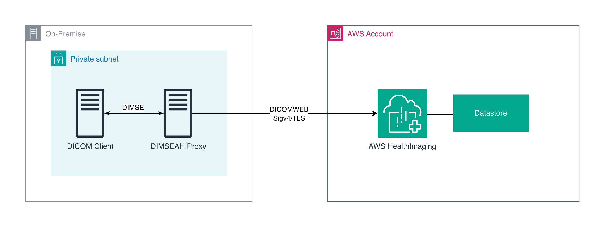

# AWS HealthImaging DICOM Proxy

A DIMSE DICOM proxy that bridges DICOM viewers and modalities to AWS HealthImaging using standard DICOM protocols (C-FIND, C-MOVE, C-STORE).

## Features

- **C-FIND Support**: Query studies, series, and instances from AWS HealthImaging
- **C-MOVE Support**: Retrieve and deliver DICOM instances via C-STORE
- **C-STORE Support**: Receive DICOM instances and forward to HealthImaging via STOW-RS
- **Per-AE Authorization**: Each DICOM client gets granular query/retrieve/store permissions
- **Per-AE C-MOVE Destinations**: Each viewer can have its own delivery hostname and port
- **Two STOW Modes** (configurable per AE):
  - **Buffered** (default): In-memory batching with multipart upload (flushes at 50MB or association end)
  - **Sync**: Each instance is STOWed immediately — C-STORE acknowledgement is only returned after AHI confirms storage
- **Throttle Handling**: Automatic retry on AHI throttling (429/503) until the request is accepted
- **Parallel Processing**: Up to 20 concurrent WADO-RS fetches with pipelined delivery
- **Multi-Region Support**: Auto-detects AWS region or uses explicit configuration
- **Comprehensive SOP Classes**: Supports 128+ DICOM storage SOP classes
- **Optional TLS**: Encrypt DICOM connections with TLS 1.2+, with optional mutual TLS for client certificate verification

## Architecture



The proxy translates DICOM network protocols to AWS HealthImaging's DICOMweb APIs:
- **C-FIND** → **QIDO-RS** (Query for studies/series/instances)
- **C-MOVE** → **WADO-RS** (Retrieve instances) + **C-STORE** (Deliver to viewer)
- **C-STORE** → **STOW-RS** (Store instances to HealthImaging)

## Prerequisites

- Python 3.12+
- AWS credentials configured (CLI or AWS Identity and Access Management (IAM) role)
- AWS HealthImaging datastore
- DICOM viewer that supports C-FIND/C-MOVE (e.g., WEASIS)

## Installation

```bash
git clone <repository>
cd DIMSEAHIProxy
python -m venv venv
source venv/bin/activate  # On Windows: venv\Scripts\activate
pip install -r requirements.txt
```

## Configuration

All configuration is in `config.json`. Copy the example to get started:

```bash
cp config.example.json config.json
```

### config.json Reference

```json
{
  "ae_title": "DICOM_PROXY",
  "port": 11112,
  "max_associations": 20,
  "datastore_id": "a1b2c3d4e5f6a1b2c3d4e5f6a1b2c3d4",
  "aws_region": "us-east-1",
  "authorized_ae_titles": [
    {
      "ae_title": "WEASIS_AE",
      "permissions": ["query", "retrieve"],
      "scu_hostname": "127.0.0.1",
      "scu_port": 11113
    },
    {
      "ae_title": "MODALITY_AE",
      "permissions": ["store"],
      "stow_mode": "sync"
    },
    {
      "ae_title": "PACS_AE",
      "permissions": ["query", "retrieve", "store"],
      "scu_hostname": "192.168.1.50",
      "scu_port": 104,
      "stow_mode": "buffered"
    }
  ],
  "tls": {
    "enabled": true,
    "cert_file": "/path/to/server.crt",
    "key_file": "/path/to/server.key",
    "ca_file": "/path/to/ca.crt"
  }
}
```

### Global Settings

| Field | Required | Default | Description |
|---|---|---|---|
| `ae_title` | No | `DICOM_PROXY` | This proxy's AE title |
| `port` | No | `11112` | This proxy's listening port |
| `max_associations` | No | `20` | Maximum concurrent DICOM associations |
| `log_level` | No | `INFO` | Logging level: `DEBUG`, `INFO`, `WARNING`, `ERROR` |
| `datastore_id` | Yes | — | HealthImaging datastore ID |
| `aws_region` | No | auto-detected | AWS region for HealthImaging |

### Per-AE Title Settings

Each entry in `authorized_ae_titles` configures a DICOM client:

| Field | Required | Default | Description |
|---|---|---|---|
| `ae_title` | Yes | — | The client's AE title |
| `permissions` | Yes | — | List of: `query`, `retrieve`, `store` |
| `scu_hostname` | If `retrieve` | — | C-MOVE delivery destination host |
| `scu_port` | No | `104` | C-MOVE delivery destination port |
| `stow_mode` | No | `buffered` | STOW-RS mode: `buffered` or `sync` |

### Permissions

- **query** — Allows C-FIND operations (search studies/series/instances)
- **retrieve** — Allows C-MOVE operations (requires `scu_hostname` for delivery)
- **store** — Allows C-STORE operations (forward to HealthImaging via STOW-RS)

### Required IAM Permissions

```json
{
    "Version": "2012-10-17",
    "Statement": [
        {
            "Sid": "HealthImagingDICOMwebAccess",
            "Effect": "Allow",
            "Action": [
                "medical-imaging:SearchDICOMInstances",
                "medical-imaging:GetDICOMSeriesMetadata",
                "medical-imaging:SearchDICOMStudies",
                "medical-imaging:SearchDICOMSeries",
                "medical-imaging:GetDICOMInstanceMetadata",
                "medical-imaging:GetDICOMInstance",
                "medical-imaging:StoreDICOM",
                "medical-imaging:StoreDICOMStudy"
            ],
            "Resource": "arn:aws:medical-imaging:<region>:<account-id>:datastore/<datastore-id>"
        }
    ]
}
```

**Note:** Replace `<region>`, `<account-id>`, and `<datastore-id>` with your specific values. The `<datastore-id>` should match the `datastore_id` in your `config.json`.

#### Applying the IAM Policy

```bash
# Save the policy above to iam-policy.json, then create it:
aws iam create-policy \
  --policy-name HealthImagingDICOMProxyPolicy \
  --policy-document file://iam-policy.json

# Attach to your execution role:
aws iam attach-role-policy \
  --role-name <your-proxy-role> \
  --policy-arn arn:aws:iam::<account-id>:policy/HealthImagingDICOMProxyPolicy
```

For on-premises hosts, configure credentials using IAM Roles Anywhere or environment variables. Avoid long-lived access keys when possible.

## Usage

### Startup

```bash
python main.py
```

The proxy reads `config.json` from the current directory on startup.

**Verify it's running** — in another terminal:

```bash
python -c "from pynetdicom import AE; ae = AE(); ae.add_requested_context('1.2.840.10008.1.1'); assoc = ae.associate('127.0.0.1', 11112); print('OK' if assoc.is_established else 'FAIL'); assoc.release() if assoc.is_established else None"
```

You should see `OK`. If you see `FAIL`, check that the proxy started without errors.

### Example Configurations

**Viewer-only (query + retrieve):**
```json
{
  "datastore_id": "a1b2c3d4e5f6a1b2c3d4e5f6a1b2c3d4",
  "aws_region": "us-east-1",
  "authorized_ae_titles": [
    {
      "ae_title": "WEASIS_AE",
      "permissions": ["query", "retrieve"],
      "scu_hostname": "127.0.0.1",
      "scu_port": 11113
    }
  ]
}
```

**Modality ingestion (store-only, sync):**
```json
{
  "datastore_id": "a1b2c3d4e5f6a1b2c3d4e5f6a1b2c3d4",
  "aws_region": "us-east-1",
  "authorized_ae_titles": [
    {
      "ae_title": "CT_SCANNER",
      "permissions": ["store"],
      "stow_mode": "sync"
    }
  ]
}
```

**Mixed environment (multiple clients):**
```json
{
  "datastore_id": "a1b2c3d4e5f6a1b2c3d4e5f6a1b2c3d4",
  "aws_region": "us-east-1",
  "authorized_ae_titles": [
    {
      "ae_title": "WEASIS_AE",
      "permissions": ["query", "retrieve"],
      "scu_hostname": "127.0.0.1",
      "scu_port": 11113
    },
    {
      "ae_title": "CT_SCANNER",
      "permissions": ["store"],
      "stow_mode": "sync"
    },
    {
      "ae_title": "PACS_SYSTEM",
      "permissions": ["query", "retrieve", "store"],
      "scu_hostname": "192.168.1.50",
      "scu_port": 104,
      "stow_mode": "buffered"
    }
  ]
}
```

### Configure Your DICOM Viewer

In WEASIS or your DICOM viewer, add a DICOM node:
- **AE Title**: `DICOM_PROXY` (or your configured `ae_title`)
- **Hostname**: `127.0.0.1` (or proxy server IP)
- **Port**: `11112` (or your configured `port`)

## STOW Modes

Configurable per AE title via the `stow_mode` field.

### Buffered Mode (default)

Best for high-throughput ingestion from modalities or PACS.

- Instances are buffered in memory during the DIMSE association
- When the buffer reaches 50MB, a multipart STOW-RS request is sent to HealthImaging
- When the association ends, any remaining buffered instances are flushed
- If a STOW-RS request fails mid-association, subsequent C-STORE requests are rejected
- Throttling (429/503) is retried automatically until accepted

### Sync Mode

Best when you need per-instance delivery confirmation.

- Each C-STORE instance is immediately forwarded to HealthImaging via STOW-RS
- The C-STORE acknowledgement is only returned to the sender **after** AHI confirms storage
- If AHI rejects the instance, the sender receives a failure status (`0xA700`)
- Throttling (429/503) is retried automatically until accepted
- Slower throughput than buffered mode, but provides per-instance delivery confirmation

## Performance Tuning

### C-STORE STOW-RS Buffer Size (buffered mode)
```python
# In cstore_handler.py
FLUSH_THRESHOLD_BYTES = 50 * 1024 * 1024  # Change to desired threshold
```

### C-MOVE Parallel Fetch Workers
The proxy uses 20 concurrent workers by default for C-MOVE retrieval.

### C-MOVE Queue Buffer Size
The delivery queue buffers 10 instances by default for C-MOVE.

### Max Concurrent Associations
```json
{
  "max_associations": 20
}
```

## Supported DICOM SOP Classes

### Query/Retrieve Information Models
- Study Root Q/R Find/Move/Get
- Patient Root Q/R Find/Move/Get
- Patient/Study Only Q/R Find/Move/Get

### Storage SOP Classes
All 128+ standard DICOM storage SOP classes are supported, including:
- CT, MR, CR, DR, US, NM, PET, RT, SC
- Enhanced CT/MR, XA, RF, VL Endoscopic/Microscopic
- Whole Slide Microscopy, Encapsulated PDF/CDA
- Structured Reports, Key Object Selection
- Presentation States, Waveforms, and more

## Troubleshooting

### Common Issues

1. **"Address already in use"**
   ```bash
   lsof -ti:11112 | xargs kill -9
   ```

2. **"Unknown Move Destination"**
   - Ensure the move destination AE title is in `authorized_ae_titles`
   - Check that `scu_hostname` and `scu_port` are correct for that AE

3. **"No presentation context"**
   - Check if your DICOM data uses a supported SOP class

4. **AWS Authentication Errors**
   ```bash
   aws sts get-caller-identity  # Verify AWS credentials
   ```

5. **STOW-RS Failures**
   - Check IAM policy includes `StoreDICOM` and `StoreDICOMStudy` actions
   - Verify datastore ID is correct
   - Check Amazon CloudWatch logs for HealthImaging errors

6. **Permission Denied**
   - Check that the AE title in your viewer matches an entry in `authorized_ae_titles`
   - Verify the AE has the required permission (`query`, `retrieve`, or `store`)

### Debug Logging

Set `log_level` to `DEBUG` in `config.json`:
```json
{
  "log_level": "DEBUG"
}
```

## TLS Configuration

By default, DICOM traffic uses unencrypted TCP, which is standard on isolated clinical networks. For environments requiring encryption, enable TLS in `config.json`:

```json
{
  "tls": {
    "enabled": true,
    "cert_file": "/path/to/server.crt",
    "key_file": "/path/to/server.key",
    "ca_file": "/path/to/ca.crt"
  }
}
```

| Field | Required | Description |
|---|---|---|
| `enabled` | No | Set to `true` to enable TLS. Default: `false` |
| `cert_file` | If TLS enabled | Path to the server certificate (PEM) |
| `key_file` | If TLS enabled | Path to the server private key (PEM) |
| `ca_file` | No | Path to CA certificate for client verification. If set, clients must present a valid certificate |

To generate self-signed certificates for testing:

```bash
openssl req -x509 -newkey rsa:4096 -keyout server.key -out server.crt -days 365 -nodes \
  -subj "/CN=DICOM Proxy"
```

When `ca_file` is provided, the proxy requires mutual TLS — DICOM clients must present a certificate signed by the specified CA. Omit `ca_file` to accept any client over TLS without client certificate verification.

### Known Limitation: C-MOVE Delivery Does Not Support TLS

TLS applies only to **inbound** DICOM connections (C-FIND, C-MOVE, C-STORE from clients to this proxy). During C-MOVE, the proxy delivers retrieved instances to the destination viewer via an **outbound** C-STORE sub-association. This outbound connection always uses plain TCP — it does not support TLS. If your C-MOVE destination (e.g., a DICOM viewer or PACS) requires TLS on its receiving port, C-MOVE delivery will fail.

### Known Limitation: QIDO-RS Pagination

C-FIND queries are translated to a single QIDO-RS request to AWS HealthImaging. If the result set exceeds the API's page size, only the first page of results is returned to the DICOM viewer. This may cause incomplete results for broad queries (e.g., all studies for a patient with a large history). Queries that include specific UIDs (StudyInstanceUID, SeriesInstanceUID) are typically unaffected.

## Architecture Details

### C-FIND Flow
1. DICOM viewer sends C-FIND request
2. Proxy checks calling AE has `query` permission
3. Proxy translates to QIDO-RS query
4. AWS HealthImaging returns DICOM JSON
5. Proxy converts to DICOM dataset format
6. Results sent back to viewer

### C-MOVE Flow
1. DICOM viewer sends C-MOVE request
2. Proxy checks calling AE has `retrieve` permission
3. Proxy discovers instances via QIDO-RS
4. 20 workers retrieve instances via WADO-RS in parallel
5. Instances delivered via C-STORE to the AE's configured `scu_hostname`/`scu_port`
6. Progress updates sent to viewer

### C-STORE → STOW-RS Flow (Buffered)
1. DICOM sender sends C-STORE requests
2. Proxy checks calling AE has `store` permission
3. Proxy buffers instances in memory (up to 50MB)
4. At threshold: multipart STOW-RS POST to HealthImaging
5. On success: buffer cleared, continue accepting
6. On failure: subsequent stores rejected
7. On association release: remaining buffer flushed

### C-STORE → STOW-RS Flow (Sync)
1. DICOM sender sends C-STORE request
2. Proxy checks calling AE has `store` permission
3. Proxy immediately STOWs the single instance to HealthImaging
4. Waits for AHI confirmation
5. Returns C-STORE success/failure to sender
6. Next instance proceeds only after previous is confirmed

### Security
- AWS SigV4 authentication for all HealthImaging API calls
- Calling AE title validated against `authorized_ae_titles` in config.json
- Per-AE granular permissions for query, retrieve, and store operations
- No persistent storage of DICOM data — all in-memory


### Risk Considerations

- **Network exposure**: Restrict the DICOM listening port (default 11112) to known DICOM clients using firewall rules or security groups. Do not expose it to the public internet.
- **Memory usage**: Buffered STOW mode holds up to 50 MB of data in memory per association. Ensure the host has sufficient memory for your expected concurrency.
- **Association failures**: In buffered mode, if a STOW-RS flush fails mid-association, remaining buffered data for that association is not retried. The sender receives failure status codes and should retry the send.
- **Throttling**: The proxy retries indefinitely on AWS HealthImaging throttling (429/503). Under sustained throttling, memory usage may grow in buffered mode.
