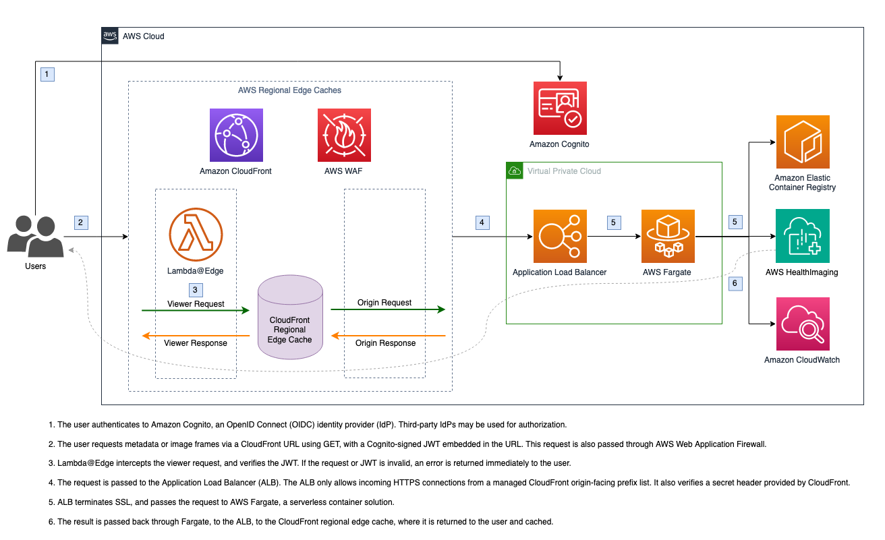

# Amazon CloudFront Delivery

This serverless project creates an [Amazon CloudFront](https://aws.amazon.com/cloudfront) distribution with an HTTPS endpoint that caches (by using GET) and delivers image frames from the edge. By default, the endpoint authenticates requests with an [Amazon Cognito](https://aws.amazon.com/cognito/) JSON web token (JWT), but can be configured to use no authentication (not recommended).

Both authentication and request signing is done at the edge using [Lambda@Edge](https://aws.amazon.com/lambda/edge/). This service is a feature of Amazon CloudFront that lets you run code closer to users of your application, which improves performance and reduces latency. There is no infrastucture to manage.

- [Amazon CloudFront Delivery](#amazon-cloudfront-delivery)
  - [Architecture](#architecture)
  - [Deployment Requirements](#deployment-requirements)
  - [Deployment Variables](#deployment-variables)
  - [Deployment](#deployment)
  - [Usage](#usage)
  - [Authentication](#authentication)
  - [Custom Domain Name](#custom-domain-name)
  - [FAQ](#faq)
  - [Cleanup](#cleanup)

## Architecture



## Deployment Requirements

-   [AWS Cloud Development Kit (cdk)](https://docs.aws.amazon.com/cdk/v2/guide/cli.html)
-   [Docker](https://www.docker.com/)
-   [Updated configuration](#deployment-variables) in [config.ts](config.ts)

[AWS Cloud9](https://aws.amazon.com/cloud9/) has the requirement packages already installed and can be used to deploy this project from the cloud.

## Deployment Variables

These variables are defined in [config.ts](config.ts) and affect the solution functionality. See the file for more information.

| Variable               | Description                                                                | Default       |
| ---------------------- | -------------------------------------------------------------------------- | ------------- |
| AHI_REGION             | AWS HealthLake Imaging region                                              | us-east-1     |
| AUTH_MODE              | Authentication mode. Supported: cognito_jwt, none                          | cognito_jwt   |
| COGNITO_USER_POOL_ID   | Amazon Cognito User Pool ID. Requied if using cognito_jwt AUTH_MODE        |               |
| COGNITO_CLIENT_ID      | Amazon Cognito User Pool Client ID. Requied if using cognito_jwt AUTH_MODE |               |
| ALB_DOMAIN             | Application Load Balancer hostname and certificate                         |               |
| CF_CUSTOM_DOMAIN       | Amazon CloudFront hostname and certificate                                 |               |
| CF_CACHE_HEADERS       | Headers to cache at CloudFront for GET requests                            | authorization |
| PROXY_LOG_LEVEL        | Logging for the serverless proxy container. Supported: debug, warn, etc.   |               |
| CONTAINER_ARCHITECTURE | Proxy container architecture. Supported: x86_64, arm64                     | x86_84        |

## Deployment

1. Check out the project.
2. Change current directory to project directory: `cd amazon-cloudfront-delivery`
3. If using CDK for the first time, run `cdk bootstrap` to [bootstrap the environment](https://docs.aws.amazon.com/cdk/v2/guide/bootstrapping.html).
4. Run `npm install` to install dependencies.
5. Review the [deployment requirements](#deployment-requirements) and update parameters in [config.ts](config.ts).
6. Run `cdk deploy --all` from the project root to deploy directly to your AWS account. This may take a few minutes.
7. The deployment process will output the HTTPS URL of the Amazon CloudFront distribution. See the [use](#use) section for directions on consuming this URL.

## Usage

The CloudFront distribution can be called at the URL generated by the CDK deployment using the same path as if you were calling the AWS HealthImaging API. Both GET and POST request will be passed through. Note that only GET requests are cached.

### Get Metadata

```
POST /datastore/<datastoreId>/imageSet/<imageSetId>/getImageSetMetadata?version=<versionId>
```

```
GET /datastore/<datastoreId>/imageSet/<imageSetId>/getImageSetMetadata?version=<versionId>
```

### Get ImageFrame

```
POST /datastore/<datastoreId>/imageSet/<imageSetId>/getImageFrame

Content-type: application/json

{
  "imageFrameId": "<imageFrameId>"
}
```

```
GET /datastore/<datastoreId>/imageSet/<imageSetId>/getImageFrame?imageFrameId=<imageFrameId>
```

## Authentication

By default, the Lambda@Edge authorizer expects an Amazon Cognito JSON Web Token (JWT) to be passed in along with the request as a bearer token in the `authorization` header. Additionally, the proxy container again verifies the JWT.

This auth flow uses the [aws-jwt-verify](https://www.npmjs.com/package/aws-jwt-verify) library. The library can optionally be used with any OIDC-compatible IDP that signs JWTs with RS256, RS384, or RS512.

To disable security (**not** recommended), modify [config.ts](config.ts) and set `AUTH_MODE` to `none`. Note this will allow _anyone_ access to your image frames.

## Custom Domain Name

There are two domain names that can be customized for this application: the Application Load Balancer and CloudFront distribution.

### Application Load Balancer (ALB)

By default, a URL and its applicable AWS Certificate Manager (ACM) certificate ARN must be provided, in order to use the ALB with an HTTPS endpoint. This ensures that traffic between CloudFront and ALB, even though it's on the private AWS network and uses a secret header, is encrypted.

To configure this domain, update `config.ts` and set `ALB_DOMAIN` with the ALB hostname and ACM ARN. After deployment, you must create a CNAME record for the `ALB_DOMAIN`'s `domainHostName` that points to the ALB URL.

Alternatively, you may deploy the ALB with an HTTP listener. This is not recommended as traffic between CloudFront and the ALB is not encrypted. However, there are several mitigations in place for this scenario:

1. The ALB's security group only allows incoming traffic from CloudFront IPs. This prevents users from going to the ALB endpoint directly.
2. The incoming request to the ALB must contain a custom string in the `X-Custom-Header` header. This is generated during deployment and set on the ALB listener as a rule, and in the CloudFront distribution.
3. The proxy container, by default, checks the incoming JWT.

To use the ALB with an HTTP endpoint, update `config.ts` and set `ALB_DOMAIN.domainHostname` to a blank string and `ALB_DOMAIN.acmArn` to `I understand encryption in transit is disabled between CloudFront to the ALB`

### Amazon CloudFront

By default, Amazon CloudFront creates a \*.cloudfront.net domain for your distribution. To use a custom domain name, update `config.ts` and set `CF_CUSTOM_DOMAIN.cfDomains` with a list of domain names, and `CF_CUSTOM_DOMAIN.cfCertificateArn` with the applicable certificate ARN from AWS Certificate Manager. This domain will use the latest `TLSv1.2_2021` security policy.

After deployment is complete, create a CNAME record for your domain name that points to the CloudFront distribution domain name. If you use Amazon Route 53, you may create an alias A record instead.

## FAQ

### Where are my logs?

Amazon CloudFront logs include standard access logs, real-time logs, and edge logs. Standard logging has been enabled for this distrubtion and is available in S3.

### Can I add a firewall to the CloudFront distribution?

Yes, you can use AWS Web Application Firewall (WAF) to monitor HTTPS requests that are forwarded to your CloudFront distribution. To enable, refer to the [documentation](https://docs.aws.amazon.com/waf/latest/developerguide/cloudfront-features.html).

### Can I limit Amazon CloudFront and Lambda@Edge access to specific image frames?

Yes. The signer Lambda@Edge function uses an execution policy that allows it access to get all image frames. You can customize the IAM policy in the [CDK stack](./lib/amazon-cloudfront-delivery-stack.ts) by applying access restrictions to the `medical-imaging:GetImageFrame` action.

## Cleanup

Amazon CloudFront replicates Lambda@Edge functions at the edge. These Lambda functions can only be deleted when all of the replicas have been deleted.

Prior to destroying the stack, the Lambda@Edge function must be disassociated from the CloudFront distribution:

1. Sign into the AWS Management Console and open the [CloudFront console](https://us-east-1.console.aws.amazon.com/cloudfront).
2. Select the distribution created by this app. Its description will mention `Amazon CloudFront distribution for AWS HealthImaging image frames`.
3. Select the **Behaviors** tab.
4. Select the default behavior and choose **Edit**.
5. Scroll to the **Function associations** section and select **No association** for all rows.
6. Select **Save changes.**

Replicas are typically deleted within a few hours.

To remove this app, run the following in the project directory:

`cdk destroy --all`

If you did not disassociate the Lambda@Edge function from the CloudFront distribution prior to running this command, the delete will fail when attempting to delete the `lambda-edge` stack. However, the CloudFront distribution (`cdn` stack) will have been deleted at this point. Simply wait for the Lambda@Edge function replicates to be removed from edge locations (up to a few hours), then run the destroy command again.
