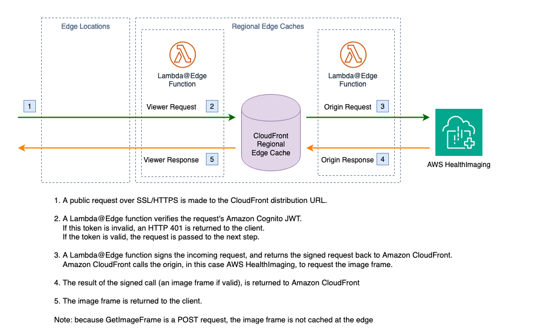

# Amazon CloudFront Image Frame Delivery

This serverless project creates an [Amazon CloudFront](https://aws.amazon.com/cloudfront) distribution with an HTTPS endpoint that caches and delivers image frames to you from the edge. By default, the endpoint authenticates requests with an [Amazon Cognito](https://aws.amazon.com/cognito/) JSON web token (JWT).

Both authentication and request signing is done at the edge using [Lambda@Edge](https://aws.amazon.com/lambda/edge/). This service is a feature of Amazon CloudFront that lets you run code closer to users of your application, which improves performance and reduces latency. There is no infrastucture to manage.

- [Amazon CloudFront Image Frame Delivery](#amazon-cloudfront-image-frame-delivery)
  - [Architecture](#architecture)
  - [Deployment Requirements](#deployment-requirements)
  - [Deployment](#deployment)
  - [Use](#use)
  - [AuthN/AuthZ](#authnauthz)
  - [Dependencies](#dependencies)
  - [FAQ](#faq)
  - [Cleanup](#cleanup)

## Architecture

## Deployment Requirements

Packages:

-   [cdk](https://docs.aws.amazon.com/cdk/v2/guide/cli.html)
-   [Docker](https://www.docker.com/)

[AWS Cloud9](https://aws.amazon.com/cloud9/) has the requirement packages already installed and can be used to deploy this project from the cloud.

During the Amazon HealthLake Imaging public preview, your account must be allow-listed into the program.

The following requirements for this solution can be found in [config.ts](config.ts).

-   `COGNITO_USER_POOL_ID`: this is the Cognito user pool ID that is used to verify the JWT. See the [AuthN/AuthZ](#authnauthz) section for more information.

## Deployment

1. Check out the project.
2. Change current directory to project directory: `cd amazon-cloudfront-image-frame-delivery`
3. If deploying for the first time, run `cdk bootstrap` to [bootstrap the environment](https://docs.aws.amazon.com/cdk/v2/guide/bootstrapping.html).
4. Run `npm install` to install dependencies.
5. Review the [deployment requirements](#deployment-requirements) and update parameters in [config.ts](config.ts).
6. Run `cdk deploy` from the project root to deploy directly to your AWS account. This may take a few minutes.
7. The deployment process will output the HTTPS URL of the Amazon CloudFront distribution. See the [use](#use) section for directions on consuming this URL.

## Use

The CloudFront distribution can be called at the URL generated by the CDK deployment using the same path as if you were calling the Amazon HealthLake Imaging API:

`<url>/runtime/datastore/<datastoreId>/imageset/<imageSetId>/imageframe/<imageFrameId>`

## AuthN/AuthZ

By default, the Lambda@Edge authorizer expects an Amazon Cognito JSON Web Token (JWT) to be passed in along with the request. The token should be passed in the header or as a query parameter using the key `token`.

This auth flow uses the [aws-jwt-verify](https://www.npmjs.com/package/aws-jwt-verify) library. The library can optionally be used with any OIDC-compatible IDP that signs JWTs with RS256, RS384, or RS512.

To disable security (**not** recommended), modify [config.ts](config.ts) and set `AUTH_MODE` to `null`. Note this will allow _anyone_ access to your image frames.

## Dependencies

### AWS

-   [AWS SDK v2](https://www.npmjs.com/package/aws-sdk)
-   [aws-jwt-verify](https://www.npmjs.com/package/aws-jwt-verify)

### Logging

-   [loglevel](https://www.npmjs.com/package/loglevel)
-   [loglevel-plugin-prefix](https://www.npmjs.com/package/loglevel-plugin-prefix)

## FAQ

### Can I use a custom domain name for my Amazon CloudFront distribution?

Yes. AWS even offers free public SSL certificates via [AWS Certificate Manager](https://aws.amazon.com/certificate-manager/). Follow [this guide](https://docs.aws.amazon.com/AmazonCloudFront/latest/DeveloperGuide/CNAMEs.html) to add an altnerate domain name to your distribution. For infrastructure-as-code using CDK, use a combination of [certificate](https://docs.aws.amazon.com/cdk/api/v2/docs/aws-cdk-lib.aws_cloudfront.Distribution.html#certificate) and [domainNames](https://docs.aws.amazon.com/cdk/api/v2/docs/aws-cdk-lib.aws_cloudfront.Distribution.html#domainnames) in the `cf.Distribution` construct.

### Where are my logs?

Amazon CloudFront logs include standard access logs, real-time logs, and edge logs. Standard logging has been enabled for this distrubtion and is available in S3.

### Can I add a firewall to the CloudFront distribution?

Yes, you can use AWS Web Application Firewall (WAF) to monitor HTTPS requests that are forwarded to your CloudFront distribution. To enable, refer to the [documentation](https://docs.aws.amazon.com/waf/latest/developerguide/cloudfront-features.html).

### Can I limit Amazon CloudFront and Lambda@Edge access to specific image frames?

Yes. The signer Lambda@Edge function uses an execution policy that allows it access to get all image frames. You can customize the IAM policy in the [CDK stack](./lib/amazon-cloudfront-image-frame-delivery-stack.ts) by applying access restrictions to the `medical-imaging:GetImageFrame` action.

## Cleanup

Amazon CloudFront replicates Lambda@Edge functions at the edge. These Lambda functions can only be deleted when all of the replicas have been deleted.

Prior to destroying the stack, the Lambda@Edge function must be disassociated from the CloudFront distribution:

1. Sign into the AWS Management Console and open the [CloudFront console](https://us-east-1.console.aws.amazon.com/cloudfront).
2. Select the distribution created by this app. Its description will mention `Amazon CloudFront distribution for Amazon HealthLake Imaging image frames`.
3. Select the **Behaviors** tab.
4. Select the default behavior and choose **Edit**.
5. Scroll to the **Function associations** section and select **No association** for all rows.
6. Select **Save changes.**

Replicas are typically deleted within a few hours.

To remove this app, run the following in the project directory:

`cdk destroy --all`

If you did not disassociate the Lambda@Edge function from the CloudFront distribution prior to running this command, the delete will fail when attempting to delete the `lambda-edge` stack. However, the CloudFront distribution (`cdn` stack) will have been deleted at this point. Simply wait for the Lambda@Edge function replicates to be removed from edge locations (up to a few hours), then run the destroy command again.
