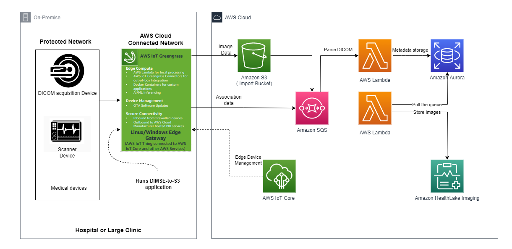
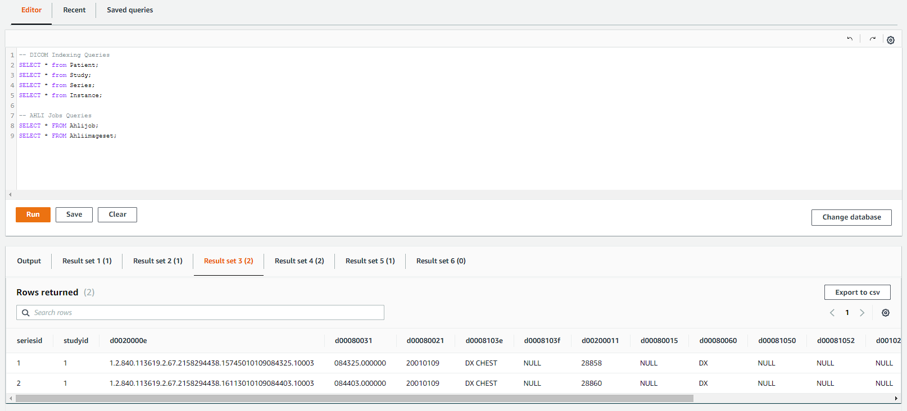
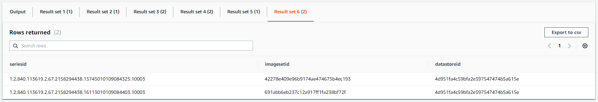

# DICOM DIMSE to S3 / Amazon HealthLake Imaging

This repository contains the code to deploy an Greengrass edge solution that receives DICOM files from a DICOM DIMSE source ( PACS, VNA, CT scanners, etc...) and store them in S3 securely. The solution indexes the DICOM files in a database and queues each DICOM series to be imported in Amazon HealthLake Imaging. It is composed of an component running at the edge, managed by AWS Greengrass IOT service, and a DICOM ingestion pipeline running in AWS Cloud. The ingestion pipeline is entirely serverless, it relies on AWS Lmabda, AWS Aurora Serverless, SQS and S3. This solution can be configured to import the DICOM files in Amazon HealthLake Imaging (default configuration). The edge is 100% python based and could be deployed on windows or Linux OSes, on a physical machine, a virtual machine or even as a container. 

 

## Requirements
You will need the following software packages installed locally to deploy this solution in AWS Cloud.

**Python3/pip:**<br>The deployment automation code is written in Python.

**CDK:**<br>Please refer to CDK documentation to [install the framework and bootstrap your AWS environment](https://docs.aws.amazon.com/cdk/v2/guide/getting_started.html#getting_started_install).

**Docker Desktop:**<br>The solution uses Docker Desktop to build the Lambda functions. Please refer to [Docker documentation](https://docs.docker.com/get-docker/) to install Docker.

**An account enabled for Amazon HealthLake Imaging:**<br> At the time this project is made available, Amazon healthLake Imaging is still in preview release state requires an account to be whitelisted. Please contact your AWS account team to get your account whitelisted or register directly on the [Amazon healthLake Imaging front page](https://aws.amazon.com/healthlake/imaging/). 

**Compatible region:**<br>This project is compatible in the following region(s): us-east-1.<br>
:warning: HealthLake Imaging is only available in us-east-1 during the preview release period.

**An edge device with access to internet:**<br> The edge device needs to be able to connect to internet. The edge device also needs to be able to connect to the DIMSE source. This can be a physical machine, a virtual machine  ( EC2, VMware, Hyper-V , KVM ) or a container. The edge device needs to be able to run python 3.10 or above.

## To deploy the project
1. Use a new AWS account to avoid quota limits.
2. Bootstrap the AWS account for CDK. Refer to [CDK documentation regarding bootstraping](https://docs.aws.amazon.com/cdk/v2/guide/bootstrapping.html).
3. Clone this repository and enter in the project folder.
4. Create virtualenv for Python. Virtual environment is needed to deploy required versions of packages:

```
$ python3 -m venv .venv
```

After the init process completes and the virtualenv is created, you can use the following
step to activate your virtualenv.

```
$ source .venv/bin/activate
```

If you are deploying this solution from a Windows operating system, you would activate the virtualenv with the command below. Make sure to execute this command in a windows command shell, not a powershell shell.

```
% .venv\Scripts\activate.bat
```

Once the virtualenv is activated, you can install the required dependencies.

```
$ python3 -m pip install -r requirements.txt
```

If needed, configure the project in the file `config.py`. Keeping the default values also works. Refer to the section [Stack configuration](#stack-configuration to understand the configuration parameters.


At this point you can synthesize and deploy the CloudFormation template for this code with the below command:

```
$ cdk deploy
```

## Stack configuration
The configuration of the stack is done in the file `config.py`. The following parameters can be configured:
<TABLE>
    <TR>
        <TH>Parameter</TH>
        <TH>Description</TH>
    </TR>
    <TR>
        <TD>CDK_APP_NAME</TD>
        <TD>Name of the CloudFormation stack</TD>
    </TR>
    <TR>
        <TD>VPC_CIDR</TD>
        <TD>CIDR of the VPC to be created</TD>
    </TR>
    <TR>
        <TD>RESOURCE_TAGS</TD>
        <TD>A series of tags that you can choose. You can have up to 50 tags in the tag_list array. All the resources created by this stack will be tagged.</TD>
    </TR>
    <TR>
        <TD>EDGE_CONFIG</TD>
        <TD>Declaration of the IOT edge devices. In this array :<BR>
        <strong>Name</strong>: This parameter needs to be unique throughout the list.<BR>
        <strong>device_type</strong>: Can be either `LOCAL` or `EC2`. In this the current release the parameter as `NO` effect. In the future, using the `EC2` will deploy the DIMSEtoS3 module in an EC2 virtual machine.</TD>
    </TR>
    <TR>
        <TD>AHLI_CONFIG</TD>
        <TD><strong>ahli_enabled</strong>: Defines if the studies received in S3 should also be imported in Amazon HealthLake Imaging.<BR>
        <strong>ahli_endpoint</strong>: Used only for AWS employees. Keep these value empty.<BR>
        <strong>ahli_concurrent_imports</strong>: Defines how many imports can be concurrently running in AHLI. This value should match the max concurrent import jobs quota limit configured in targeted AWS account.</TD>
    </TR>
    <TR>
        <TD>DB_CONFIG</TD>
        <TD><strong>db_name</strong>: The name of the database to index the DICOM files and queue the import jobs to Amazon HealthLake Imaging. <br>:information_source: Default: `iep`<BR>
        <strong>db_engine_pause</strong>: Engine idle time before the SQL engine goes to sleep.<br>:information_source: Default: `20` (mins)<br>
        <strong>min_acu_capacity</strong>: Defines the minimum number of Aurora capacity units (ACUs). Each ACU is a combination of approximately 2 gigabytes (GB) of memory, corresponding CPU, and networking.<BR>
        :information_source: Default: `ACU_8`<BR>
        <strong>min_acu_capacity</strong>: Defines the maximum number of Aurora capacity units (ACUs). Each ACU is a combination of approximately 2 gigabytes (GB) of memory, corresponding CPU, and networking.<BR>:information_source: Default: `ACU_64` </TD>
    </TR>
</TABLE>

## Install an Greengrass Core device 

### IOT Core device requirements
Refer to the [AWS Greengrass IOT documentation](https://docs.aws.amazon.com/greengrass/v2/developerguide/setting-up.html) to ensure that the device meets the requirements.


### Install an Greengrass Core device on Ubuntu 22.04.

The steps below describe how to install an AWS Greengrass IoT device on a ubuntu 22.04 instance. The steps are similar for other operating systems.

1. Logged in with the `ubuntu` user, run the following commands in the prompt. Confirm all the prompts with their default values.
    ```
    sudo apt update && sudo apt -y upgrade && sudo apt -y install default-jre && sudo apt -y install unzip
    ```

2. Located in the ubuntu home folder (`cd ~`) , execute following command :
    ```
    curl -s https://d2s8p88vqu9w66.cloudfront.net/releases/greengrass-nucleus-latest.zip > greengrass-nucleus-latest.zip && unzip greengrass-nucleus-latest.zip -d GreengrassInstaller
    ```

3. From a computer where the awscli is configured with the same AWS account as the one where the CloudFormation stack is deployed, execute the following command to get the AWS temporary credentials used to install the IOT device. The cloudformation generates an IAM role called `[STACK_NAME]-GGInstallerRole` for this purpose. Replace the placeholder `[AWS_ACCOUNT]` with the AWS account number where the CloudFormation stack is deployed:
    ```
    aws sts assume-role --role-arn arn:aws:iam::[AWS_ACCOUNT]:role/[STACK_NAME]-GGInstallerRole --role-session-name "GGInstaller"
    ```
    The command returns the temporary credentials:
    ```
    {
    "Credentials": {
        "AccessKeyId": "ASIAQTBUADFXEXAMPLE",
        "SecretAccessKey": "gCWOYooKz/YoDIM30TeTF15pufxOWPFlsfJpHOUX",
        "SessionToken": "IQoJb3JpZ2luX2VjEPz...HLF+h+Adjl6o=",
        "Expiration": "2023-04-24T20:52:08+00:00"
    },
    "AssumedRoleUser": {
        "AssumedRoleId": "AROAQTBUADFXSREXAMPLE:GGInstaller",
        "Arn": "arn:aws:sts::[AWS_ACCOUNT]:assumed-role/iep2-GGInstallerRole/GGInstaller"
        }
    }

4. On the ubuntu machine used to deploy the Edge device, export the temporary credentials as environment variables.
    ```
    export AWS_ACCESS_KEY_ID=[YOUR ACCESS KEY ID]
    export AWS_SECRET_ACCESS_KEY=[YOUR SECRET ACESS KEY]
    export AWS_SESSION_TOKEN=[YOUR SESSION TOKEN]
    ```

5. Use the command below to deploy the AWS Greengrass IoT Core device software. Replace the placeholders `[STACK_NAME]`, `[AWS_REGION]`, and `[EDGE_NAME]`:
<br>The `[STACK_NAME]` is the name of the CloudFormation stack created by the CDK deployment, it is declared as the `CDK_APP_NAME` in the file `config.py`.<br>The `[EDGE_NAME]` is the name of the edge device currently being installed, Edge device names are declared in the EDGE_CONFIG array in the file `config.py`.<br>The `[AWS_REGION]` is the AWS region where the CloudFormation stack is deployed. Execute the following command to install the IOT device software:<br>
[ Note : Pick one value in array]
    ```
    sudo -E java -Droot="/greengrass/v2" -Dlog.store=FILE -jar ./GreengrassInstaller/lib/Greengrass.jar --aws-region [AWS_REGION] --thing-name [STACK_NAME]-[EDGE_NAME] --thing-group-name [STACK_NAME]-IEP-devices --component-default-user ggc_user:ggc_group --provision true --setup-system-service true --deploy-dev-tools true -trn [STACK_NAME]-[EDGE_NAME]-GG-Role -tra [STACK_NAME]-[EDGE_NAME]-GG-Role-Alias
    ```

6. At this point the installation of the IOT device should complete successfully. The script execution should produce outputs similar to the ones below :
    ```bash
    buntu@ip-172-31-90-218:~$ sudo -E java -Droot="/greengrass/v2" -Dlog.store=FILE -jar ./GreengrassInstaller/lib/Greengrass.jar --aws-region us-east-1 --thing-name iep4-edge-1 --thing-group-name iep4-IEP-devices --component-default-user ggc_user:ggc_group --provision true --setup-system-service true --deploy-dev-tools true -trn iep4-edge-1-GG-Role -tra iep4-edge-1-GG-Role-Alias
    Provisioning AWS IoT resources for the device with IoT Thing Name: [iep4-edge-1]...
    Found IoT policy "GreengrassV2IoTThingPolicy", reusing it
    Creating keys and certificate...
    Attaching policy to certificate...
    Creating IoT Thing "iep4-edge-1"...
    Attaching certificate to IoT thing...
    Successfully provisioned AWS IoT resources for the device with IoT Thing Name: [iep4-edge-1]!
    Adding IoT Thing [iep4-edge-1] into Thing Group: [iep4-IEP-devices]...
    IoT Thing Group "iep4-IEP-devices" already existed, reusing it
    Successfully added Thing into Thing Group: [iep4-IEP-devices]
    Setting up resources for aws.greengrass.TokenExchangeService ...
    Attaching TES role policy to IoT thing...
    No managed IAM policy found, looking for user defined policy...
    IAM policy named "iep4-edge-1-GG-RoleAccess" already exists. Please attach it to the IAM role if not already
    Configuring Nucleus with provisioned resource details...
    Root CA file found at "/greengrass/v2/rootCA.pem". Contents will be preserved.
    Downloading Root CA from "https://www.amazontrust.com/repository/AmazonRootCA1.pem"
    Created device configuration
    Successfully configured Nucleus with provisioned resource details!
    Thing group exists, it could have existing deployment and devices, hence NOT creating deployment for Greengrass first party dev tools, please manually create a deployment if you wish to
    Successfully set up Nucleus as a system service
    ```
7. The IOT device should be visible in the AWS Greengrass IOT web console->Greengrass devices->Core Devices. The IoT device name is `[STACK_NAME]-[EDGE_NAME]`. After a few minutes the device runs the DIMSEtoS3 component and a `DICOM listener should be available on the port 1112`. You can monitor the deployement of the DIMSEtoS3 component in the log at `/greengrass/v2/logs/greengrass.log` on the IOT device. :warning: Accessing to the logs folder requires root privileges.

8. The IoT device is now ready to receive DICOM data, you can test the deployment by following the instructions in the [Test the deployment](#test-the-deployment) section below.

## Test the deployment

You can test your deployment by sending DICOM data to the edge device on its `port 11112`. To simulate a DICOM client you can use the DCMTK `storescu` utility, refer to this link to download and install the DCMTK toolkit on your machine: https://dicom.offis.de/en/dcmtk/dcmtk-tools/. Once installed, follow the instructions below to send the DICOM test datast to the edge device:

1. With a terminal located in at the root of this project, navigate in the dcmdata folder:
    ```
    cd dcmdata
    ```
2. Execute the storescu command to send the DICOM data to the edge device, replace the placeholders `[EDGE_IP_ADDRESS]` by the local IP address of the edge device VM.
    :information_source: the edge device is in promiscuous mode, therefore it can be called with any AE-title you would like.
    ```
    storescu -v -aec EDGE_AE -aet CLIENT_AE [EDGE_IP_ADDRESS] 11112 *.dcm
    ```
    :warning: Make sure that the machine from where you are executing this command has network connectivity to the edge device IP address.

3. The command output should look like this:
    ``` bash
    (.venv) ubuntu@ip-172-31-77-27:~/code/iep-cdk/dcmdata$ storescu -v -aec EDGE_AE -aet CLIENT_AE 54.80.236.18 11112 *.dcm
    I: checking input files ...
    I: Requesting Association
    I: Association Accepted (Max Send PDV: 16370)
    I: Sending file: 1.2.840.113619.2.67.2158294438.16324010109084338.243.dcm
    I: Converting transfer syntax: Little Endian Implicit -> Little Endian Implicit
    I: Sending Store Request (MsgID 1, DX)
    XMIT: .................................................
    I: Received Store Response (Success)
    I: Sending file: 1.2.840.113619.2.67.2158294438.16324010109084413.245.dcm
    I: Converting transfer syntax: Little Endian Implicit -> Little Endian Implicit
    I: Sending Store Request (MsgID 2, DX)
    XMIT: .................................................
    I: Received Store Response (Success)
    I: Releasing Association
    (.venv) ubuntu@ip-172-31-77-27:~/code/iep-cdk/dcmdata$
    ```

You can verify the proper ingestion of the data by checking the content of the S3 bucket created by the stack. The bucket name is `[STACK_NAME]-iepbucketsiepdicombucket`. the DICOM data should be stored in the `s3://[STACK_NAME]-iepbucketsiepdicombucket/[STACK_NAME]-[EDGE_NAME]/UUID4/1.2.840.113619.2.67.2158294438.15745010109084247.20000`

You can verify that the data was properly indexed in the database and submitted to Amazon HealthLake Imaging by connecting to the database via the `Query Editor` of the RDS menu in the AWS Web Console:

1. Logged in the AWS Web Console, open the Secrets Manager service.
2. In the Secrets Manager menu, left side bar, select Secrets.
3. In the Secrets list, search for the secret starting with the name `[STACK_NAME]IEPAurora`.
4. Click on the secret name to open the secret details.
5. In the secret details, Copy the secret ARN value.
6. Logged in the AWS Web console, open the RDS service.
7. In the RDS menu, left side bar, select Query Editor.
8. In the Query Editor dialog, select the database named [STACK_NAME]-iepauroradb.
8. In the Query Editor dialog, for the database username , select `Connect with a Secrets Manager ARN`.
9. In the Connect to database dialog, for the Secrets Manager ARN, `paste the ARN copied in step 5`.
10. In the Query Editor dialog,  for the name of the database or schema, enter the name of the database as configured in the file `config.py`, default is `iep`.
11. In the Query Editor dialog, click on the button `Connect to database`.

In the query editor, you can run the following queries to verify that the data was properly ingested in the database:

```sql
-- DICOM Indexing Queries
SELECT * from Patient;
SELECT * from Study;
SELECT * from Series;
SELECT * from Instance;

-- AHLI Jobs Queries
SELECT * FROM Ahlijob;
SELECT * FROM Ahliimageset;
```


Click through the different result tabs to check the content of the different tables. Note the the table `Ahliimageset` remains empty until the import job to Amazon HealthLake Imaging is completed. You can monitor the status of the job in the database table `Ahlijob` and in the AWS Web Console in the Amazon HealthLake Imaging service.

```tabular
Status 1 : Job in queue.
Status 2 : Job in progress.
Status 3 : Job completed.
Status 4 : Job failed.
```
Once the import job has completed, you can check the content of the `Ahliimageset` table again, it should now contain the mapping between the DICOM series and the AHLI ImageSet.


## Clean up

Before to clean-up the stack you need to make sure that the S3 bucket used to store the DICOM data is emptied. You can empty the DICOM bucket from the S3 menu of the AWS Web console. 

    1. Logged in the AWS Web console, open the S3 service.
    2. In the S3 service menu, left side bar, select Buckets.
    3. In the Buckets list, type `[STACK_NAME]-iepbucketsiepdicombucket` in the search field, and click the checkbox to the left of the list on the row `[STACK]-dicom-bucket`.
    4. In the buckets list, click on the button `[ Empty ]` and confirm the prompt.


To clean up the resources created by this project, run the following command. Make sure that the `CDK_APP_NAME` variable in the `config.py` file is set to the same value as the one used during the deployment. Also make sure that python virtual environment is activated. 

```bash
cdk destroy
```
Confirm the prompt with `y` to delete the stack.


