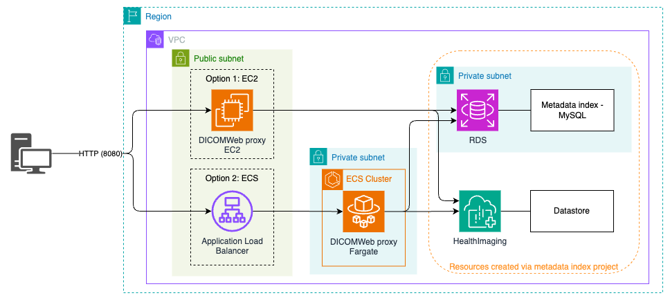

# AHI DICOMWeb Proxy


## Description
This project allows to expose a DICOM WADO / QIDO endpoint on top of an AHI datastore. The project depends on the [AHI metadata index project](https://github.com/aws-samples/aws-healthimaging-samples/tree/main/metadata-index) configured with the RDBMS mode. See how to deploy the metadata index in RDBMS mode 1st, before this AHI DICOMWeb proxy can be used. 

## Project design

## Installation
This project is 100% python based and can be installed simply by copying the content of this repository onto an EC2 instance running ubuntu 22.04. The DICOMWeb proxy service needs to connect to the metadata-index MYSQL database with a database user granted with read-only permissions, and to the AHI datastore(s) referenced in the metadata index database. Upon start-up the service gets the database information and user credentials from AWS Secrets Manager. Here is a TODO list of what should be configured and installed for this project to function, below are also more detailed steps if needed :

1. [Create a read-only database user in the RDBMS metadata index MYSQL database.](#creating-the-dicomweb-proxy-database-user)
2. [Create a Secrets Manager secret representing the read-only user and database connection information.](#creating-the-secret-in-secrets-manager)
3. [Create an IAM policy and IAM role that will be used by the EC2 instance to access to the secret in Secrets Manager and the AHI datastore.](#Create-a-iam-policy-and-role-for-the-ec2-instance.)
4. [Option 1] EC2\
	Step 1: [Create an EC2 instance with the Ubuntu 22.04 Linux image.](#creating-an-ec2-instance)\
	Step 2: [Assign the newly created role to the instance.](#create-a-iam-policy-and-role-for-the-ec2-instance)\
	Step 3: [Install the project files from the repository and execute it via python.](#installing-the-dicomweb-proxy-files-on-the-instance)\
	[Optional] Step 3 : Install systemctl config files for the DICOMWeb proxy application to be managed as a Linux service.
5. [Option 2] ECS\
	[Create ECR private repository, ECS Cluster, Task definition and Service](#create-ecr-private-repository-ecs-cluster-task-definition-and-service)
6. Update the RDS instance security group to allow the EC2/ECS instance to access to the database.


### Creating the DICOMWeb proxy database user.
1. With your preferred database client, connect to the RDS MYSQL instance created by the metadata index project deployment with an admin user.
2. Once connected, run the following command:
```
CREATE USER 'dicomwebproxy'@'localhost' IDENTIFIED BY '[Replace this by your own password]';
GRANT SELECT, SHOW VIEW ON `ahiindex`.* TO 'dicomwebproxy'@'localhost'
FLUSH PRIVILEGES;
SHOW GRANTS FOR 'dicomwebproxy'@'localhost'
```

### Creating the secret in Secrets Manager.

1. Navigate in the AWS console Secrets Manager menu.
2. Click on the `[ Store a new secret ]` button.
3. Create the secret with the following parameters:

&nbsp;&nbsp;&nbsp;&nbsp;&nbsp;&nbsp;&nbsp;&nbsp;&nbsp;&nbsp;&nbsp;&nbsp;&nbsp;&nbsp;&nbsp;&nbsp;&nbsp;&nbsp;<strong>Secret Type:</strong> Credentials for Amazon RDS database

&nbsp;&nbsp;&nbsp;&nbsp;&nbsp;&nbsp;&nbsp;&nbsp;&nbsp;&nbsp;&nbsp;&nbsp;&nbsp;&nbsp;&nbsp;&nbsp;&nbsp;&nbsp;<strong>User name:</strong> dicomwebproxy

&nbsp;&nbsp;&nbsp;&nbsp;&nbsp;&nbsp;&nbsp;&nbsp;&nbsp;&nbsp;&nbsp;&nbsp;&nbsp;&nbsp;&nbsp;&nbsp;&nbsp;&nbsp;<strong>Password:</strong> Enter the password you have entered while creating the database user.

&nbsp;&nbsp;&nbsp;&nbsp;&nbsp;&nbsp;&nbsp;&nbsp;&nbsp;&nbsp;&nbsp;&nbsp;&nbsp;&nbsp;&nbsp;&nbsp;&nbsp;&nbsp;<strong>Database:</strong> Select the database cluster hosting the AHI metadata index.

&nbsp;&nbsp;&nbsp;&nbsp;&nbsp;&nbsp;&nbsp;&nbsp;&nbsp;&nbsp;&nbsp;&nbsp;&nbsp;&nbsp;&nbsp;&nbsp;&nbsp;&nbsp;<strong>Secret name:</strong> ahi-dicomwebproxy.

&nbsp;&nbsp;&nbsp;&nbsp;&nbsp;&nbsp;&nbsp;&nbsp;&nbsp;&nbsp;&nbsp;&nbsp;&nbsp;&nbsp;&nbsp;&nbsp;&nbsp;&nbsp;<strong>Description:</strong> "This secret is used by the DICOMWeb proxy service to connect to the AHI metadata index."

4. After the Review menu, click `[ Store ]`.
5. Refesh the secret list and click on the new secret.
6. In the secret detail menu, note down the secret ARN. It will be used in the next steps.


### Create a IAM policy and role for the EC2 instance.
We will create an IAM role that will be assigned to the EC2 instance running the DICOMWeb proxy service. This role is given privileges to access to the secret in Secrets Manager secret and to the AHI datastore with read-only permissions only.

#### Secret Manager access Policy creation
1. In the AWS Console IAM service menu, select `Policies` in the left navigation menu and click `[ Create Policy ]`.
2. In the `Specifiy permissions` menu , click on the [JSON] button, and copy the following policy in the text editor:
```
{
	"Version": "2012-10-17",
	"Statement": [
		{
			"Sid": "VisualEditor0",
			"Effect": "Allow",
			"Action": "secretsmanager:GetSecretValue",
			"Resource": "[Replace this value with the secret ARN noted above.]"
		}
	]
}
```
4. Click `[ Next ]`.
5. In the Policy details menu, enter the following information, then click `[ Create Policy ]`.

&nbsp;&nbsp;&nbsp;&nbsp;&nbsp;&nbsp;&nbsp;&nbsp;&nbsp;&nbsp;&nbsp;&nbsp;&nbsp;&nbsp;&nbsp;&nbsp;&nbsp;&nbsp;<strong>Policy Name:</strong> ahi-dicomwebproxy-secretmanager-access

&nbsp;&nbsp;&nbsp;&nbsp;&nbsp;&nbsp;&nbsp;&nbsp;&nbsp;&nbsp;&nbsp;&nbsp;&nbsp;&nbsp;&nbsp;&nbsp;&nbsp;&nbsp;<strong>Description:</strong> This policy allows the DICOMWeb Proxy service to access to the database secret.

#### HealhtImaging access Policy creation
1. In the AWS Console IAM service menu, select `Policies` in the left navigation menu and click `[ Create Policy ]`.
2. In the `Specifiy permissions` menu , click on the [JSON] button, and copy the following policy in the text editor:
```
{
	"Version": "2012-10-17",
	"Statement": [
		{
			"Sid": "VisualEditor0",
			"Effect": "Allow",
			"Action": [
				"medical-imaging:GetImageSet",
				"medical-imaging:GetImageSetMetadata",
				"medical-imaging:GetImageFrame"
			],
			"Resource": [
				"[Replace this by your AHI datastore ARN]/imageset/*",
				"[Replace this by your AHI datastore ARN]"
			]
		}
	]
}
```
4. Click `[ Next ]`.
5. In the Policy details menu, enter the following information, then click `[ Create Policy ]`.

&nbsp;&nbsp;&nbsp;&nbsp;&nbsp;&nbsp;&nbsp;&nbsp;&nbsp;&nbsp;&nbsp;&nbsp;&nbsp;&nbsp;&nbsp;&nbsp;&nbsp;&nbsp;<strong>Policy Name:</strong> ahi-dicomwebproxy-ahi-access

&nbsp;&nbsp;&nbsp;&nbsp;&nbsp;&nbsp;&nbsp;&nbsp;&nbsp;&nbsp;&nbsp;&nbsp;&nbsp;&nbsp;&nbsp;&nbsp;&nbsp;&nbsp;<strong>Description:</strong> This policy allows the DICOMWeb Proxy service to access to the AHI datastore.


#### Role creation

1. In the AWS Console IAM service menu, select `Roles` in the left navigation menu and click `[ Create role ]`.
2. Enter the following parameters :

&nbsp;&nbsp;&nbsp;&nbsp;&nbsp;&nbsp;&nbsp;&nbsp;&nbsp;&nbsp;&nbsp;&nbsp;&nbsp;&nbsp;&nbsp;&nbsp;&nbsp;&nbsp;<strong>Trusted Entitiy type:</strong> AWS service.

&nbsp;&nbsp;&nbsp;&nbsp;&nbsp;&nbsp;&nbsp;&nbsp;&nbsp;&nbsp;&nbsp;&nbsp;&nbsp;&nbsp;&nbsp;&nbsp;&nbsp;&nbsp;<strong>Use case:</strong> EC2.

3. Click `[ Next ]`.
4. In the Add permissions menu , select the policy `ahi-dicomwebproxy-secretmanager-access`.
5. In the Add permissions menu , select the policy `ahi-dicomwebproxy-ahi-access` and click `[ Next ]`.
6. In the Name, review, and create menu, enter the following parameters, then click `[ Create role ]`:

&nbsp;&nbsp;&nbsp;&nbsp;&nbsp;&nbsp;&nbsp;&nbsp;&nbsp;&nbsp;&nbsp;&nbsp;&nbsp;&nbsp;&nbsp;&nbsp;&nbsp;&nbsp;<strong>Role Name:</strong> ahi-dicomwebproxy-ec2-role

&nbsp;&nbsp;&nbsp;&nbsp;&nbsp;&nbsp;&nbsp;&nbsp;&nbsp;&nbsp;&nbsp;&nbsp;&nbsp;&nbsp;&nbsp;&nbsp;&nbsp;&nbsp;<strong>Description:</strong> This role allows the DICOMWeb Proxy service to access to the database secret and AHI datastore.


### Creating an EC2 instance.
At this point we have configured the database user, created a secret in Secrets Manager and created the IAM policy and role. We can now create the EC2 instance that will host the DICOMWeb service. Configure the EC2 instance with the following parameters :

&nbsp;&nbsp;&nbsp;&nbsp;&nbsp;&nbsp;&nbsp;&nbsp;&nbsp;&nbsp;&nbsp;&nbsp;&nbsp;&nbsp;&nbsp;&nbsp;&nbsp;&nbsp;<strong>Name:</strong> ahi-dicomweb-proxy.

&nbsp;&nbsp;&nbsp;&nbsp;&nbsp;&nbsp;&nbsp;&nbsp;&nbsp;&nbsp;&nbsp;&nbsp;&nbsp;&nbsp;&nbsp;&nbsp;&nbsp;&nbsp;<strong>Application and OS Images:</strong> Select ubuntu 22.04 LTS.

&nbsp;&nbsp;&nbsp;&nbsp;&nbsp;&nbsp;&nbsp;&nbsp;&nbsp;&nbsp;&nbsp;&nbsp;&nbsp;&nbsp;&nbsp;&nbsp;&nbsp;&nbsp;<strong>Instance type:</strong> Select an instance with 4 CPUs and 8GB of RAM or above.  Eg: c6a.xlarge.

&nbsp;&nbsp;&nbsp;&nbsp;&nbsp;&nbsp;&nbsp;&nbsp;&nbsp;&nbsp;&nbsp;&nbsp;&nbsp;&nbsp;&nbsp;&nbsp;&nbsp;&nbsp;<strong>Key pair:</strong> Select your preferred key pair.

&nbsp;&nbsp;&nbsp;&nbsp;&nbsp;&nbsp;&nbsp;&nbsp;&nbsp;&nbsp;&nbsp;&nbsp;&nbsp;&nbsp;&nbsp;&nbsp;&nbsp;&nbsp;<strong>Network settings:</strong> Click on `[ Edit ]` and enter the following parameters :

&nbsp;&nbsp;&nbsp;&nbsp;&nbsp;&nbsp;&nbsp;&nbsp;&nbsp;&nbsp;&nbsp;&nbsp;&nbsp;&nbsp;&nbsp;&nbsp;&nbsp;&nbsp;&nbsp;&nbsp;&nbsp;&nbsp;&nbsp;&nbsp;&nbsp;&nbsp;&nbsp;&nbsp;&nbsp;&nbsp;&nbsp;&nbsp;&nbsp;&nbsp;&nbsp;&nbsp;<strong>VPC:</strong> Select the same VPC as the one hosting the metadata index database.

&nbsp;&nbsp;&nbsp;&nbsp;&nbsp;&nbsp;&nbsp;&nbsp;&nbsp;&nbsp;&nbsp;&nbsp;&nbsp;&nbsp;&nbsp;&nbsp;&nbsp;&nbsp;&nbsp;&nbsp;&nbsp;&nbsp;&nbsp;&nbsp;&nbsp;&nbsp;&nbsp;&nbsp;&nbsp;&nbsp;&nbsp;&nbsp;&nbsp;&nbsp;&nbsp;&nbsp;<strong>Subnet:</strong> Select a public subnet.

&nbsp;&nbsp;&nbsp;&nbsp;&nbsp;&nbsp;&nbsp;&nbsp;&nbsp;&nbsp;&nbsp;&nbsp;&nbsp;&nbsp;&nbsp;&nbsp;&nbsp;&nbsp;&nbsp;&nbsp;&nbsp;&nbsp;&nbsp;&nbsp;&nbsp;&nbsp;&nbsp;&nbsp;&nbsp;&nbsp;&nbsp;&nbsp;&nbsp;&nbsp;&nbsp;&nbsp;<strong>Firewall:</strong>

&nbsp;&nbsp;&nbsp;&nbsp;&nbsp;&nbsp;&nbsp;&nbsp;&nbsp;&nbsp;&nbsp;&nbsp;&nbsp;&nbsp;&nbsp;&nbsp;&nbsp;&nbsp;&nbsp;&nbsp;&nbsp;&nbsp;&nbsp;&nbsp;&nbsp;&nbsp;&nbsp;&nbsp;&nbsp;&nbsp;&nbsp;&nbsp;&nbsp;&nbsp;&nbsp;&nbsp;&nbsp;&nbsp;&nbsp;&nbsp;&nbsp;&nbsp;&nbsp;&nbsp;&nbsp;&nbsp;&nbsp;&nbsp;&nbsp;&nbsp;&nbsp;&nbsp;Select `Create security group` 

&nbsp;&nbsp;&nbsp;&nbsp;&nbsp;&nbsp;&nbsp;&nbsp;&nbsp;&nbsp;&nbsp;&nbsp;&nbsp;&nbsp;&nbsp;&nbsp;&nbsp;&nbsp;&nbsp;&nbsp;&nbsp;&nbsp;&nbsp;&nbsp;&nbsp;&nbsp;&nbsp;&nbsp;&nbsp;&nbsp;&nbsp;&nbsp;&nbsp;&nbsp;&nbsp;&nbsp;&nbsp;&nbsp;&nbsp;&nbsp;&nbsp;&nbsp;&nbsp;&nbsp;&nbsp;&nbsp;&nbsp;&nbsp;&nbsp;&nbsp;&nbsp;&nbsp;&nbsp;Security group name : ahi-dicomwebproxy
 
&nbsp;&nbsp;&nbsp;&nbsp;&nbsp;&nbsp;&nbsp;&nbsp;&nbsp;&nbsp;&nbsp;&nbsp;&nbsp;&nbsp;&nbsp;&nbsp;&nbsp;&nbsp;&nbsp;&nbsp;&nbsp;&nbsp;&nbsp;&nbsp;&nbsp;&nbsp;&nbsp;&nbsp;&nbsp;&nbsp;&nbsp;&nbsp;&nbsp;&nbsp;&nbsp;&nbsp;&nbsp;&nbsp;&nbsp;&nbsp;&nbsp;&nbsp;&nbsp;&nbsp;&nbsp;&nbsp;&nbsp;&nbsp;&nbsp;&nbsp;&nbsp;&nbsp;
Description : Security group for ahi-dicomweb proxy service.

&nbsp;&nbsp;&nbsp;&nbsp;&nbsp;&nbsp;&nbsp;&nbsp;&nbsp;&nbsp;&nbsp;&nbsp;&nbsp;&nbsp;&nbsp;&nbsp;&nbsp;&nbsp;&nbsp;&nbsp;&nbsp;&nbsp;&nbsp;&nbsp;&nbsp;&nbsp;&nbsp;&nbsp;&nbsp;&nbsp;&nbsp;&nbsp;&nbsp;&nbsp;&nbsp;&nbsp;&nbsp;&nbsp;&nbsp;&nbsp;&nbsp;&nbsp;&nbsp;&nbsp;&nbsp;&nbsp;&nbsp;&nbsp;&nbsp;&nbsp;&nbsp;&nbsp;
Inbound Securty Group Rules : Add a new rule of type `Custom TCP` with the port `8080`. The source depends on your on needs. If you are unsure select `My IP` for the source type, this will only allow accessing the DICOMWeb service from the public IP address you are currently accessing to the AWS Web Console with. These settings can be changed later on.

&nbsp;&nbsp;&nbsp;&nbsp;&nbsp;&nbsp;&nbsp;&nbsp;&nbsp;&nbsp;&nbsp;&nbsp;&nbsp;&nbsp;&nbsp;&nbsp;&nbsp;&nbsp;<strong>Configure Storage:</strong> Configure the storage with `150GB` of capacity and type `GP3`.

6. Click  `[ Launch Instance ]` . This will create the instance.

 &nbsp;&nbsp;&nbsp;&nbsp;<strong>Configure the security group of the RDS instance for the metadata index database to allow the security group of the EC2/ECS instance created above to access to the RDS instance on port `3306`.</strong>

### Installing the DICOMWeb proxy files on the instance.

The service requires python 3.10 which should come by default on ubuntu 22.04 python. To simplify its usage we can install the python-is-python3 package which allows to link the `python` command to the latest python3.x version.


```
sudo apt update -y && sudo apt upgrade -y
sudo apt install python-is-python3 -y
sudo apt install python3-pip -y
```

```
cd ~
git clone https://github.com/aws-samples/aws-healthimaging-samples.git
cd aws-healthimaging-samples
cd ./dicomweb-proxy
python -m pip install -r requirements.txt 
```

 The application can then be executed with the following command:

 ```
DB_SECRET_ARN=[Secrets Manager secret ARN created in the Creating the secret in Secrets Manager section] AWS_DEFAULT_REGION=[The AWS region where this instance is hosted] python main.py
 ```

The service startup log should look like this :

```
INFO:botocore.credentials:Found credentials in shared credentials file: ~/.aws/credentials
INFO:root:[Startup] - Forking FrameFetcher FF0
INFO:root:[Startup] - Forking FrameFetcher FF1
INFO:root:[Startup] - Forking FrameFetcher FF2
INFO:root:[Startup] - Forking FrameFetcher FF3
INFO:root:[Startup] - Forking FrameFetcher FF4
INFO:root:[Startup] - Forking FrameFetcher FF5
INFO:root:[Startup] - Forking FrameFetcher FF6
INFO:botocore.credentials:Found credentials in shared credentials file: ~/.aws/credentials
INFO:root:QIDO/WADO-RS service started.
INFO:waitress:Serving on http://0.0.0.0:8080
```


 Optionally the code can be turned into a standalone one file application for better portability.

 ```
 python -m pip install nuitka
 nuitka3  --follow-imports --include-package=pydicom --standalone --onefile main.py
 ```
Once compiled the application is bundled into the main.bin exectuable. In this form the applicaiton can be executed with the followinf command:
```
DB_SECRET_ARN=[Secrets Manager secret ARN created in the Creating the secret in Secrets Manager section] AWS_DEFAULT_REGION=[The AWS region where this instance is hosted] ./main.bin
```


### Create ECR private repository, ECS Cluster, Task definition and Service

Follow these steps to deploy the application on ECS:

1. Create ECR repository and get its URI
```bash
# Deploy ECR CloudFormation stack
aws cloudformation deploy \
  --template-file ecr-cfn-template.yaml \
  --stack-name dicomweb-proxy-ecr \
  --capabilities CAPABILITY_IAM

# Get the ECR repository URI
ECR_URI=$(aws cloudformation describe-stacks \
  --stack-name dicomweb-proxy-ecr \
  --query 'Stacks[0].Outputs[?OutputKey==`ECRRepositoryURI`].OutputValue' \
  --output text)
```

2. Build and push Docker image to ECR
```bash
# Build image
docker build -t "${ECR_URI}:latest" .

# Login to ECR
aws ecr get-login-password --region $AWS_REGION | docker login --username AWS --password-stdin $ECR_URI

# Push image
docker push "${ECR_URI}:latest"
```

3. Deploy ECS infrastructure \
Required parameters:\
<strong>VpcId:</strong>ID of the VPC where ECS service will be deployed\
<strong>SubnetIds:</strong>Comma-separated list of subnet IDs (minimum 2 subnets)\
<strong>DBSecretArn:</strong> ARN of the Secrets Manager secret created in [Step 2](#creating-the-secret-in-secrets-manager)

```bash
# Deploy ECS CloudFormation stack
aws cloudformation deploy \
  --template-file ecs-cfn-template.yaml \
  --stack-name dicomweb-proxy-ecs \
  --capabilities CAPABILITY_IAM \
  --parameter-overrides \
    ECRImageURI="${ECR_URI}:latest" \
    VpcId=<your-vpc-id> \
    SubnetIds=<subnet-1>,<subnet-2> \
    DBSecretArn=<your-secret-arn>
```

Example:
```bash
aws cloudformation deploy \
  --template-file ecs-cfn-template.yaml \
  --stack-name dicomweb-proxy-ecs \
  --capabilities CAPABILITY_IAM \
  --parameter-overrides \
    DICOMWebProxyECRImageURI="${ECR_URI}:latest" \
    VpcId=vpc-0a1b2c3d4e \
    SubnetIds=subnet-0a1b2c3d,subnet-1b2c3d4e \
    DBSecretArn=arn:aws:secretsmanager:us-east-1:123456789012:secret:my-secret-123abc
```

## Usage

Once installed and started `the service listens on the port 8080 by default`. It exposes the below resources :

<table>
<tr>
<th>Resource</th><th>Description</th>
</tr>
<tr>
<td>
/aetitle/health
</td>
<td>
Health monitoring resource. Returns HTTP response code 200 and responde body : OK when the service is functional.
</td>
</tr>

<tr>
<td>
/aetitle/studies
</td>
<td>
QIDO resource for querying at the study level.
</td>
</tr>

<tr>
<td>
/aetitle/studies/&lt;studyInstanceUID&gt;/series
</td>
<td>
QIDO resource for querying at the series level in the context of a study.
</td>
</tr>

<tr>
<td>
/aetitle/studies/&lt;studyInstanceUID&gt;/instances
</td>
<td>
QIDO resource for querying at the instance level in the context of a study.
</td>
</tr>

<tr>
<td>
/aetitle/series
</td>
<td>
QIDO resource for querying at the series level.
</td>
</tr>

<tr>
<td>
/aetitle/studies/&lt;studyInstanceUID&gt;/series/&lt;seriesInstanceUID&gt;/instances
</td>
<td>
QIDO resource for querying at the instance level in the context of a series.
</td>
</tr>

<tr>
<td>
/aetitle/instances
</td>
<td>
QIDO resource for querying at the instance level.
</td>
</tr>


<tr>
<td>
/aetitle/studies/&lt;StudyInstanceUID&gt;/metadata
</td>
<td>
WADO resource for querying study metadata.
</td>
</tr>

<tr>
<td>
/aetitle/studies/&lt;StudyInstanceUID&gt;/series/&lt;SeriesInstanceUID&gt;
</td>
<td>
WADO resource to retrieve instances of the series as multipart HTTP response.
</td>
</tr>

<tr>
<td>
/aetitle/studies/&lt;StudyInstanceUID&gt;/series/&lt;SeriesInstanceUID&gt;/metadata
</td>
<td>
WADO resource to retrieve metadata of a series.
</td>
</tr>

<tr>
<td>
/aetitle/studies/&lt;StudyInstanceUID&gt;/series/&lt;SeriesInstanceUID&gt;/instances/&lt;InstanceUID&gt;
</td>
<td>
WADO resource to retrieve a bulk instance as multipart HTTP response.
</td>
</tr>

<tr>
<td>
/aetitle/studies/&lt;StudyInstanceUID&gt;/series/&lt;SeriesInstanceUID&gt;/instances/&lt;InstanceUID&gt;/rendered
</td>
<td>
WADO resource to retrieve a rendered representation of the image in JPEG format.
</td>
</tr>

<tr>
<td>
/aetitle/studies/&lt;StudyInstanceUID&gt;/series/&lt;SeriesInstanceUID&gt;/instances/&lt;InstanceUID&gt;/metadata
</td>
<td>
WADO resource to retrieve the metadata of an instance.
</td>
</tr>

<tr>
<td>
/aetitle/studies/&lt;StudyInstanceUID&gt;/series/&lt;SeriesInstanceUID&gt;/instances/&lt;InstanceUID&gt;/frames/&lt;Frames&gt;
</td>
<td>
WADO query to retrieve the frame of an instance. Unlike the standard that allows multiple frames to be requested at once, this resource only allow 1 frame to be returned. (Fits most open source viewers implementation)
</td>
</tr>

</table>

The service can be used by configuring the DICOMWeb endpoint of your client with the public DNS or IP address of the EC2/ALB instance in the following URL to `http://[EC2 instance IP or EC2/ALB DNS]:8080/aetitle`. See an example below with the [WEASIS](https://weasis.org/en/index.html) application:


