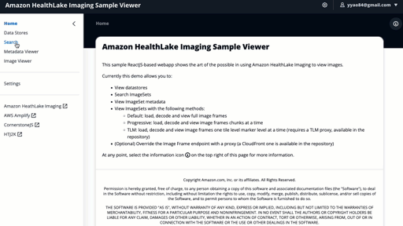

# AWS HealthImaging Viewer UI

This [AWS Amplify](https://aws.amazon.com/amplify/) project deploys a full-stack web application with an UI based on [Cloudscape](https://cloudscape.design/) and backend authentication services using [Amazon Cognito](https://aws.amazon.com/cognito/).

This app allows you to view datastores, search ImageSets, view ImageSet metadata, and view images. There are also multiple ways to load image frames, including default (full image frames), progressive (chunk by chunk) and tile level marker (discrete tile level markers).

The [Tile Level Marker (TLM) Proxy](../tile-level-marker-proxy/) and/or [Amazon CloudFront Delivery](../amazon-cloudfront-delivery/) projects can be incorporated into the image viewer as an alternative method of image loading.



-   [AWS HealthImaging Viewer UI](#aws-health-imaging-viewer-ui)
    -   [Architecture](#architecture)
    -   [Deployment Requirements](#deployment-requirements)
    -   [Deployment](#deployment)
    -   [Usage](#usage)
    -   [Dependencies](#dependencies)
    -   [FAQ](#faq)
    -   [Cleanup](#cleanup)

## Architecture


## Deployment Requirements

During the AWS HealthImaging public preview, your account must be allow-listed into the program.

Packages needed for manual deployments only:

-   [npm](https://www.npmjs.com/)
-   [cdk](https://docs.aws.amazon.com/cdk/v2/guide/cli.html)
-   [aws-cli](https://docs.aws.amazon.com/cli/latest/userguide/getting-started-install.html)
-   [Amplify CLI](https://docs.amplify.aws/cli/)

[AWS Cloud9](https://aws.amazon.com/cloud9/) has the requirement packages already installed and can be used to deploy this project from the cloud.

By default, the app is configured to use AWS HealthImaging in the `us-east-1` region. To change the region or endpoint, log into the app and use the _Settings_ page to modify the region.

## Deployment

### Automatic

[](https://console.aws.amazon.com/amplify/home#/deploy?repo=https://github.com/aws-samples/aws-healthimaging-samples)

### Semi-Automatic via AWS CodeCommit

This deployment method uses the AWS Amplify console to deploy the web app.

1. Navigate to the [AWS console for AWS CodeCommit](https://console.aws.amazon.com/codesuite/codecommit/home)
2. Select **Create repository**
3. Give the repository a name and select **Create**. Note the repository name can be different from this repository's name
4. Push the entirety of this repository (`aws-health-imaging-samples`) to the AWS CodeCommit repository. Refer to the [documentation](https://docs.aws.amazon.com/codecommit/latest/userguide/setting-up.html) on instructions.
5. Navigate to the [AWS console for AWS Amplify](https://console.aws.amazon.com/amplify/home)
6. Select **New app**, then **Host web app**
7. Select **AWS CodeCommit**, then select **Continue**
8. Select the AWS CodeCommit repository you created earlier, and verify that the branch is correct
9. Select **Next**
10. Feel free to change the app name on the _Build settings_ screen
11. Verify `amplify.yml` is detected in the _Build and test settings_ section
12. In the _IAM Role_ section, select _Use an existing service role_ if you've used Amplify before, and have an existing service role. Otherwise keep the default option _Create and use a new service role_.
13. Select **Next**
14. Review the app settings, and select **Save and deploy**
15. If a build fails, you can review the logs from the AWS Amplify console. You can also attempt a rebuild by selecting the failed build, then selecting the _Redeploy this version_ button.
    _Note:_ if the error says Amplify app ID not found, modify the build service IAM role to include the _AdministratorAccess-Amplify_ AWS-managed policy. You can find the build service IAM role by selecting _General_ in the Amplify app console.
16. The web app URL is named `https://<backend env name>.<app id>.amplifyapp.com` and can be found in the **Hosting environments** tab

### Manual

Manual deployment uses the [Amplify CLI](https://docs.amplify.aws/cli/). You also need to have IAM user with programmatic access, with the `AdministratorAccess-Amplify` AWS-managed IAM policy attached. Deployment requires a \*nix environment.

<details>
  <summary>Configure IAM User</summary>
  <ul>
    <li>Navigate to the <a href="https://console.aws.amazon.com/iamv2/home#/users">AWS Console for IAM users</a></li>
    <li>Select <b>Add users</b></li>
    <li>Give your user a descriptive user name, e.g. <i>amplifyDeployUser</i>, and select ONLY <b>Access key - Programmatic access</b> for the credential type</li>
    <li>In the <b>Set permissions</b> section, select <b>Attach existing policies directly</b></li>
    <li>Search for <i>AdministratorAccess-Amplify</i> in the <b>Filter policies</b> section</li>
    <li>Select <b>AdministratorAccess-Amplify</b></li>
    <li>Select <b>Next: Tags</b></li>
    <li>Add any tags to this user as needed</li>
    <li>Select <b>Next: Review</b></li>
    <li>Make sure AWS access type only lists <b>Programmatic access</b> and the permissions list contains <b>AdministratorAccess-Amplify</b></li>
    <li>Select <b>Create User</b></li>
    <li>Do not close this page</li>
  </ul>
</details>

<details>
  <summary>Configure AWS CLI</summary>
  <ul>
    <li>On the command line, run <b>aws configure --profile [profile name]</b></li>
    <li>Copy and paste the <b>Access key ID</b> from the IAM console</li>
    <li>Copy and paste the <b>Secret access key</b> from the IAM console and continue</li>
    <li>Select the default region, e.g. <i>us-east-1</i>, and continue</li>
    <li>Optionally, select an output format, e.g. <i>json</i>, and continue</li>
    <li>Back at the command line, run the following to test your access: <b>aws --profile [profile name] sts get-caller-identity</b>
  </ul>
</details>

<details>
  <summary>Update the IAM User for <a href="https://github.com/aws-amplify/amplify-cli/issues/9911">CLI issue</a></summary>
  <ul>
    <li>Navigate to the <a href="https://console.aws.amazon.com/iamv2/home#/users">AWS Console for IAM users</a></li>
    <li>Select the user you created during the first step</li>
    <li>Select <b>Add inline policy</b></li>
    <li>Select the <b>JSON</b> tab</li>
    <li>Paste the following into the JSON editor, replacing the existing text:</li>
    {
      "Version": "2012-10-17",
      "Statement": [
        {
          "Effect": "Allow",
          "Action": [
            "cloudfront:GetCloudFrontOriginAccessIdentity"
          ],
          "Resource": "*"
        }
      ]
    }
    <li>Give the policy a name, e.g. <i>Workaround-For-Amplify-Cli-9911</i>, then select <b>Create policy</b></li>
  </ul>
</details>

#### Initialize Amplify

1. Check out the git repository.
2. Change current directory to project directory: `cd imaging-viewer-ui`
3. Initialize the Amplify environment: `amplify init`
4. Enter a name for the environment, e.g. `dev`
5. Select the default code editor. If you do not plan on editing the code, select the default.
6. For authentication method, select `AWS profile`
7. If you have more than one AWS CLI profile, use the arrow keys to select the AWS CLI profile you configured earlier.
8. Amplify will now deploy its base scaffolding via AWS CloudFormation.

#### Deploy Full-Stack App

1. Add hosting: `amplify add hosting`
2. Use the arrow keys to select `Amazon CloudFront and S3`
3. Use the arrow keys to select `PROD (S3 with CloudFront using HTTPS)`
4. Optionally use a custom hosting bucket name. This is a private S3 bucket that is used to host static content
5. Prior to running the next step, make sure you have added the additional IAM policy via the <b>Update the IAM User for CLI issue</b> section above
6. Publish the app: `amplify publish`
7. Verify that an Auth and Hosting resource will be deployed. Input `Y`, then enter to continue
8. Amplify will now deploy Amazon Cognito, S3 and CloudFront. It will also run react-scripts via npm to build the web app and deploy it to S3 to be hosted by CloudFront. Note this may take a few minutes.
9. The web app URL is displayed during deployment as `Hosting endpoint`. Alternatively, you can find it in the [Amazon CloudFront console](https://console.aws.amazon.com/cloudfront/v3/home)

## Usage

Amplify deploys a public-accessible website. When you first visit the site, select the **Sign In** link at the top right of the page. From there, select **Create Account** and fill in the required information. Once authenticated, you have access to all features of this web app. Note that you can view additional contextual information on any page by selecting the information icon on the right side of the screen.

## Dependencies

### AWS Amplify Libraries

-   [aws-amplify](https://github.com/aws-amplify/amplify-js)

### UI Components

-   [@aws-amplify/ui-react](https://github.com/aws-amplify/amplify-ui)
-   [@cloudscape-design/components](https://github.com/cloudscape-design/components)
-   [@cloudscape-design/global-styles](https://github.com/cloudscape-design/global-styles)

### Metadata

-   [ace-builds](https://github.com/ajaxorg/ace-builds)

### Image Viewer - Decoder

-   [openjphjs](https://github.com/chafey/openjphjs)

### Image Viewer - Cornerstone

-   [cornerstone-core](https://github.com/cornerstonejs/cornerstone)
-   [cornerstone-math](https://github.com/cornerstonejs/cornerstoneMath)
-   [cornerstone-tools](https://github.com/cornerstonejs/cornerstoneTools)
-   [hammerjs](https://github.com/hammerjs/hammer.js)

### Data Retrieval

-   [axios](https://github.com/axios/axios)

### General Utilities

-   [clipboardy](https://github.com/sindresorhus/clipboardy)

### Data Parsing & Formatting

-   [pretty-bytes](https://github.com/sindresorhus/pretty-bytes)
-   [dayjs](https://github.com/iamkun/dayjs)

### React & Friends

-   [react](https://github.com/facebook/react)
-   [react-dom](https://github.com/facebook/react)
-   [react-router-dom](https://github.com/remix-run/react-router)

## FAQ

### Can I deploy this web app without AWS Amplify?

This app is tightly-coupled with the [Amplify JavaScript library](https://docs.amplify.aws/lib/q/platform/js/) for authentication with AWS. Credentials provided by this library are used to sign requests to the AWS HealthImaging Service. In order to replace this mechanism, look for references to the `aws-exports.js` file, which is generated by AWS Amplify.

### I have strict IAM controls in place. Can I avoid using the `AdministratorAccess-Amplify` role?

Yes, see [deployment security](./docs/deployment-security.md). This document describes how you can deploy this application using IAM permissions, focused on least-privilege for IAM.

### Can I disable user sign-ups on the web app?

Yes. There are two methods. First is removing the sign up UI from the frontend. Modify the [Auth component](src/components/Auth/Auth.jsx) using the [Amplify documentation](https://ui.docs.amplify.aws/react/connected-components/authenticator/configuration#hide-sign-up). The second method is to disable sign-ups on Amazon Cognito. To do this, modify the [Amplify auth override](amplify/backend/auth/imagingViewerUiAuth/override.ts) file and within the override function, add the following code:

```
resources.userPool.adminCreateUserConfig = {
    allowAdminCreateUserOnly: true,
};
```

### Can I change the token validity duration?

Because this is sample code that deploys into a public-facing site, token refresh durations has been shortened from their defaults to 60 minutes. This means your app credentials are only valid for an hour. To modify this, update [override.ts](amplify/backend/auth/imagingViewerUiAuth/override.ts). Reference the [Amplify documentation](https://docs.amplify.aws/cli/auth/override/) for a list of options.

### Can I password-protect the web app?

Yes. You must have deployed the application using the AWS Amplify console. See [restricting access to branches](https://docs.aws.amazon.com/amplify/latest/userguide/access-control.html) documentation here.

### How does the web app have IAM access to AWS HealthImaging?

During deployment, Amplify creates two IAM roles: unauthenticated and authenticated. The unauthenticated role is configured to have no access to AWS services. The authenticated role is configured to have access to services configured to Amplify, as well as `medical-imaging` read only actions, defined in the project level's [override.ts](amplify/backend/awscloudformation/override.ts).

## Cleanup

1. Navigate to the [AWS console for AWS Amplify](https://console.aws.amazon.com/amplify/home)
2. Select the web app
3. On the top right, select **Actions**, then **Delete app**
