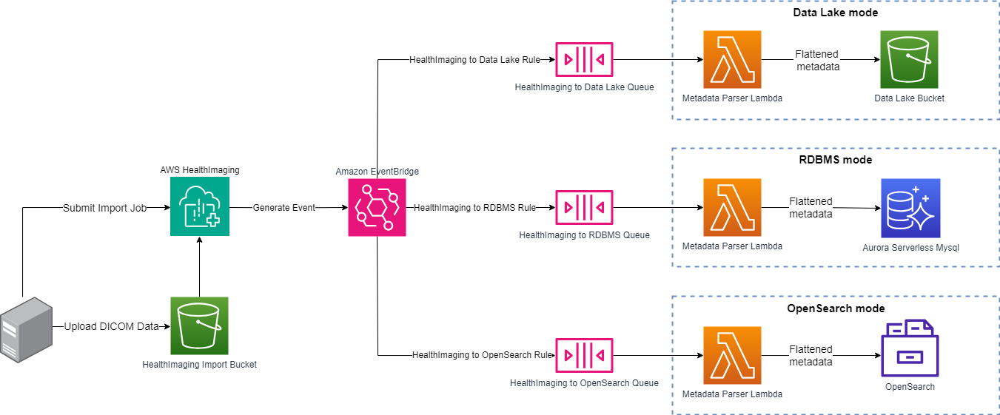

# Solution Architecture
The project deploys AWS HealthImaging (AHI) EventBridge Event rules that send messages into SQS queues. SQS queues trigger Lambda functions that retrieve AHI Image Set metadata, and parse and export them to the target data store ( RDS Aurora MYSQL , Amazon S3 Data Lake , and/or Amazon OpenSearch Service ).
