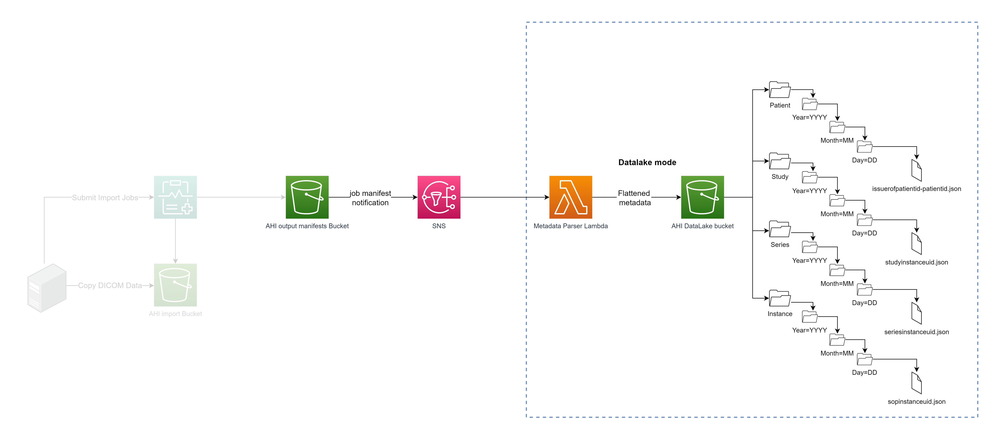

# Datalake Data Model
The datalake data model is based on the separation of the patient, study , series and instance DICOM blocks into separate JSON documents. This is done to facilitate the search and retrieval of DICOM data based on the different levels of the DICOM hierarchy. With this the intend is to allow for the creation of 4 tables via AWS Glue, and enable capabilities for SQL queries via AWS Athena for the purpose of data analytics and data science. 
>`Note`: By default basic AWS Glue tables are deployed with the solution to allow queries at the patient , study, series and instance level via Athena/Quicksight. 

Because there is a need to related each row of each level (patient, studies, series, instane) to their origin imagsetid and datastoreid, the imagesetid and datastoreid are added to each row of the JSON document. Each rows in the different tables are linked by the following identifiers:

- Patient table is considered the root of the hierarchy.<br />
- Study table links to patient table via the patientid field.<br />
- Series table links to study table via the studyinstanceuid field.<br />
- Instance table links to series table via the seriesinstanceuid field.<br />

## S3 bucket structure:
The solution creates 4 folder at the root of the datalake s3 bucket. The folder names are: `patient`, `study`, `series` and `instance`. Inside of each folder a directory structure of type year/mont/day is created and used as partition keys. This allwos the datalake to scale to large number of DICOM files. The DICOM files are stored in the corresponding folder based on the DICOM tag value. The DICOM tag used to determine the folder name is the `StudyDate` tag. The DICOM files are stored in the following format:

***patient:***
```
s3://[datalake_bucket_name]/patient/year=[year_of_study]/month=[month_of_study]/day=[day_of_study]/[issuerofpatientid]-[patientid].json
```
***study:***
```
s3://[datalake_bucket_name]/study/year=[year_of_study]/month=[month_of_study]/day=[day_of_study]/studyinstanceuid.
json
```
***series:***
```
s3://[datalake_bucket_name]/series/year=[year_of_study]/month=[month_of_study]/day=[day_of_study]/seriesinstanceuid.json
```
***instance:***
```
s3://[datalake_bucket_name]/instance/year=[year_of_study]/month=[month_of_study]/day=[day_of_study]/sopinstanceuid.json
```
>Note: In case the `StudyDate` DICOM tag is not present in the DICOM file, the solution will use the current date as the study date.

The solution avoids duplicate entries thanks to the usage of file names based on DICOM unique identifies for the study, series and instance levels. In theory the patientid is supposed to be a unique value with a single domain. for this reason the file name for the patient level is based on a concatenation of the issuer of the patientid and the patientid. 

>Note: <mark>The `IssuerOfPatientID` is optional in DICOM standard an may not be present in the DICOM file. In this case it is possible that 2 patient files describing 2 different patients from different domains , but with the same PatientID may produce the same file name, resulting in the overwrite of the former patient with the information of the most recently imported one. This would also cause studies from the from the former patient to appear as attached to the new patient. This is a limitation of the solution.</mark> This could be avoided by injecting the IssuerOfPatientID in the DICOM files before the import to the AHI datastore; or by creating on AHI datastore per patient domain and updating the Lambda datalake parser to set a prefix to the patientid based on the source datastore of the metadata.


