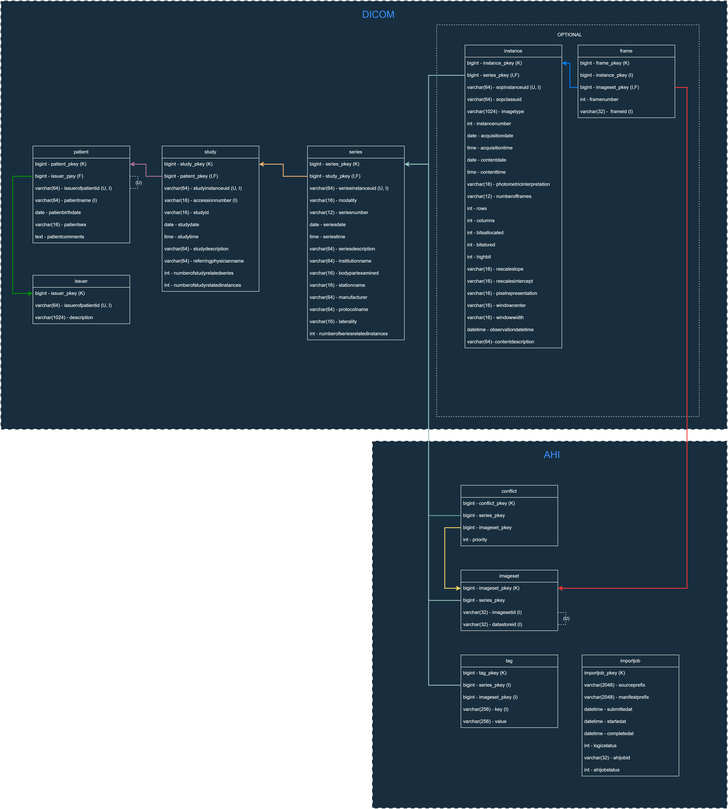

#Aurora MYSQL Data Model

The data model assumes that DICOM studies are composed of objects globally uniques at the study, series and instance level. Unlike AWS HealthImaging the metadata indexed in Aurora MYSQL is re-strucutured with respect to the DICOM hierarchy:  
* ***Issuer***: This table contains the list of Issuer Of Patient Id level ( Metadata["Patient"]["DICOM"] ). The value of the DICOM tag `IssuerOfPatientID` is used as unique key in the issuer table. all ImageSets referring to a common `IssuerOfPatientID` are represented by a single entry in the issuer table.
>`Note:` metadata for which no IssuerOfPatientID value is populated will be represented as `DEFAULT_DOMAIN` in the issuer table.
  
* ***Patient***: This table contains the tags related to the information found in AHI metadata for the patient level ( Metadata["Patient"]["DICOM"] ). The value of the DICOM tag `PatientID` and `IssuerOfPatientID` are used as composite unique key in the patient table. all ImageSets referring to a common `PatientID` and `IssuerOfPatientID` are represented by a single entry in the patient table. 
>`Note:` metadata for which no PatientID value is populated will be represented as `NO_PID` in the patient table.
  
* ***Study***: This table contains the tags related to the information found in AHI metadata for the study level  ( Metadata["Study"]["DICOM"] ). The value of the DICOM tag `StudyInstanceUD` is used as unique key in the study table. all ImageSets referring to a common `StudyInstanceUID` are represented by a single entry in the study table.
  
* ***Series***: This table contains the tags related to the information found in AHI metadata for the series level  ( Metadata["Study"]["Series"][SeriesInstanceUID]["DICOM"] ). The value of the DICOM tag `SeriesInstanceUID` is used as unique key in the series table. all ImageSets referring to a common `SeriesInstanceUID` are represented by a single entry in the series table.
  
* ***Instance***: This table contains the tags related to the information found in AHI metadata for the instance level  ( Metadata["Study"]["Series"][SeriesInstanceUID]["Instances"][SOPInstanceUID]["DICOM"] ). The value of the DICOM tag `SOPInstanceUID` is used as unique key in the instance table. all ImageSets referring to a common `SOPInstanceUID` are represented by a single entry in the instance table.
>`Note:` Indexing of the instance level is optional. (see `rdbms_config.populate_instance_level` parameter in the `config.json` file).
  
* ***Frame***: This table is used to track the frames for each DICOM instance. The table the  AHI `FrameId` for the each framme of an instance, along with a link to the primary of the ImagetSetId in the ImageSet table. The table is used to faciliate the display of the data in AHI.
  
* ***ImageSet***: This table contains the mappings between the ImageSetID and the series primtary key in the series table. 
  
* ***Tag***: This table contains the mappings between the the series primary keys and key/value pairs tags associated to the series. this value can be used to track if tags have to be or were already applied to imagesets in AHI. 
  
* ***Importjob***: This tbale can be used as poart of the data import logic in in AWS HealthImaing. you can use the table to track job to be imported in AHI, by data imput locaiton of S3 and manifest file location.
  
* ***Conflict***: This table is used to track series referred by more than 1 ImageSet. The table contains a mapping of the series primary key in the series table and the primary keys in the imageset table. Conflicts situations dot not prevent access to the metadata and pixel data in AHI. However, duplication of Imagesets for the same DICOM series may lead to degraded performance in the display of the data, and overhead in the consistency upkeep of the metadata.

