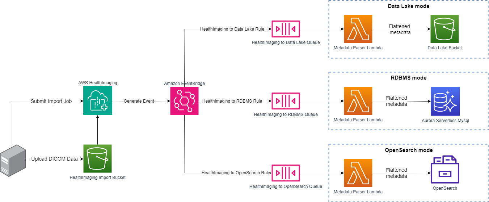

# Solution Architecture

## Prior Art: `metadata-index`

Previously, we built a S3 event-driven image set metadata index solution, known as [metadata-index](../../../metadata-index/).  Three shortcomings limited the practical application of the S3 event-driven solution:

**1. Only supports the HealthImaging DICOM import job use case.**

The `metadata-index` solution relies on parsing the HealthImaging DICOM import job manifest to retrieve the list of image set id’s for processing.  As a result, the solution can only support the HealthImaging DICOM import job use case, and not all other HealthImaging use cases that involve metadata changes.

**2. Poor resiliency due to “all or nothing” image set collection processing.**

A HealthImaging DICOM import job could generate only one `s3:ObjectCreated` event, which in turn can trigger only one SNS notification and one Lambda function invocation.  A failure to process any one image set in the collection translates to a failure in processing the entire collection.

**3. Lack of scalability due to a single Lambda function invocation.**

A HealthImaging DICOM import job could import an arbitrarily large number of image sets.  For sufficiently large number of image sets, the single Lambda function invocation may not be able to process the metadata changes for all image sets before reaching the 15 minute execution time limit.

## `metadata-index-v2` Architecture

The diagram below illustrates the `metadata-index-v2` solution architecture.  For each target metadata store: Amazon Aurora MySQL, Amazon Simple Storage Service (Amazon S3) data lake, and OpenSearch, the `metadata-index-v2` solution involves the following setup steps:

1. Create a target-specific EventBridge rule that watches for specific HealthImaging image set events, such as `Image Set Copied`, `Image Set Created`, `Image Set Deleted`, and `Image Set Updated`.

2. For each image set processed by HealthImaging, the target-specific EventBridge rule sends the appropriate HealthImaging image set event to a target-specific Amazon Simple Queue Service (Amazon SQS) queue.

3. The target-specific SQS queue triggers a target-specific Lambda function that process metadata changes for the target metadata store.

## How `metadata-index-v2` addresses shortcomings of `metadata-index`

The `metadata-index-v2` solution uses the EventBridge integration for HealthImaging to address the shortcomings of the previous `metadata-index` solution:

**1. Supports all HealthImaging use cases that involve metadata changes.**

By watching for HealthImaging image set events, the `metadata-index-v2` solution can support all HealthImaging use cases that involve metadata changes.

**2. Improved resiliency due to image set events and use of SQS dead-letter queues.**

For each target-specific Lambda function, for each image set, we can configure the maximum receives that a Lambda function invocation can attempt to process metadata changes (e.g., 10 tries per image set), before giving up and sending the failed image set id to a SQS dead-letter queue for further error handling and/or notification.

**3. Increased scalability due to the combination of batch size and maximum concurrency.**

For each target-specific Lambda function, as part of the SQS trigger definition, we can configure the batch size that can be processed by each Lambda function invocation (e.g., 40 image sets per invocation), and the maximum concurrency in terms of Lambda function invocations (e.g., 100 concurrent invocations).
