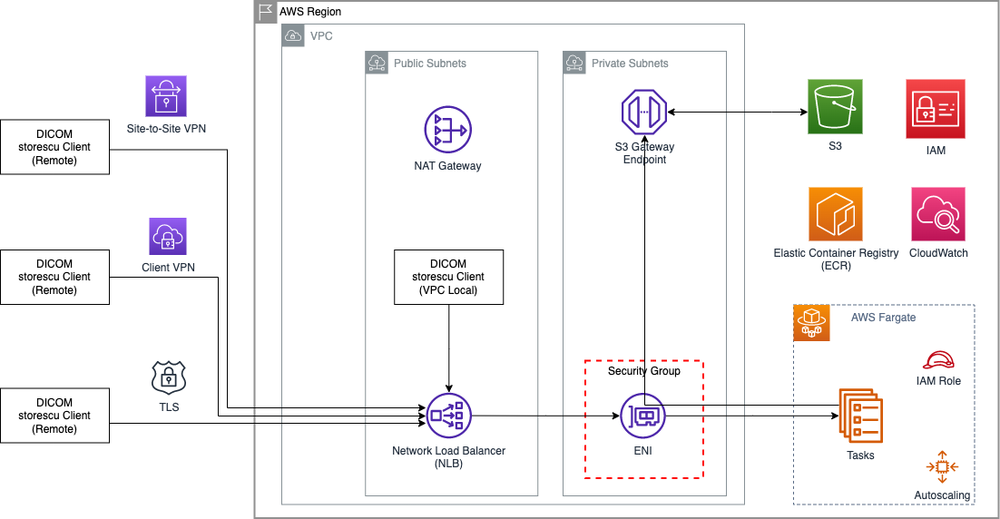

# Welcome to the s3storescp project!

This project implements a DICOM storescp listener capable of receiving DIMSE messages and storing the received SOP instances as DICOM Part10 files on Amazon S3. 

## Features

- Built using [Python](https://www.python.org/) and [AWS CDK v2 (Cloud Development Kit)](https://aws.amazon.com/cdk/).
- Deploy to [AWS ECS Fargate](https://aws.amazon.com/fargate/).
- Provide a [DICOM](https://www.dicomstandard.org/current) storecp service capable of receiving instances using DIMSE.
- Store received DICOM SOP instances as DICOM Part10 objects on [Amazon S3](https://aws.amazon.com/s3/).
- Extract and store DICOM Metadata as [JSON](https://www.json.org/json-en.html) on [Amazon S3](https://aws.amazon.com/s3/).
- Compress stored objects using gzip content encoding.
- Provide TLS encryption option for the DIMSE connection, using [stunnel](https://www.stunnel.org/).
- Receive multiple concurrent DICOM associations.
- Autoscale horizontally to support variable workloads.

## Architecture



The application is deployed as as one or more tasks on ECS Fargate. Each task provides a DICOM storescp listener, and a TLS-enabled tunnel to that listener. Inbound DICOM connections are recieved on a Network Load Balancer and distributed to the Tasks. As DICOM instances are received, they are stored as DICOM Part 10 files in an S3 bucket. Optionally, a JSON dump of the DICOM metadata can also be created and stored on S3. Elastic Container Registry (ECR) is used to store and deploy the container image. Task logs are stored in CloudWatch.

## Prerequisites

- [AWS account](https://aws.amazon.com/premiumsupport/knowledge-center/create-and-activate-aws-account/)
- [Node.js](https://nodejs.org/en/download/)
- [Python3](https://www.python.org/) 
- [AWS CDK v2](https://docs.aws.amazon.com/cdk/v2/guide/getting_started.html#getting_started_prerequisites)

## Deployment

Infrastructure is provisioned using AWS CDK v2. 

Some variation in commands may be needed if you're running on OSX or Windows. Please refer to the [CDK](https://docs.aws.amazon.com/cdk/v2/guide/getting_started.html) and [CLI](https://docs.aws.amazon.com/cli/latest/userguide/cli-chap-getting-started.html) documentation and ensure your AWS profile and credentials are configured correctly prior to deployment.

If this is the first time you are using the AWS CDK with the AWS Account - please note the section on [Bootstrapping](https://docs.aws.amazon.com/cdk/v2/guide/getting_started.html#getting_started_bootstrap).

Generally, the steps to deploy the solution on a Linux-based environment are:

1. Install prerequisites (see Prerequisites section)
1. Configure your AWS profile and credentials
3. Check out the code (`git clone`, then `cd` into the top level directory)
4. Create and activate a Python virtual environment (`python3 -m venv .venv`, then `source .venv/bin/activate`)
6. Install required Python packages (`pip3 install -r requirements.txt`)
7. Configure the application (see Configuration section)
5. Deploy Application (`cdk synth`, `cdk deploy`)

You can monitor the deployment by navigating to the AWS CloudFormation [console](https://console.aws.amazon.com/cloudformation/) or by viewing the output of the `cdk deploy` command.

After successful deployment, the DNS of the Network Load Balancer is displayed. You can also view that by inspecting the ECS configuration for the deployed service. Use that DNS name, and the configured application port(s) to send DICOM to the service. Note that the storescp listener runs in promiscuous mode, and will accept connections from/to ANY AE titles.

## Security

The application provisions a non-encrypted StoreSCP listener, and a TLS-enabled listener (using [stunnel](https://www.stunnel.org/)), which can be used to provide TLS encryption of the DICOM connection. Connections to the TLS-enabled listener are decrypted and forwarded locally to the non-TLS storescp. Note that the sending client is responsible for the encryption of the connection. That can be accomplished by using `stunnel` in client mode, or by using a storescu client with native TLS capabilities.

By default, access to the application is permitted only from the VPC it is provisioned in, and access to the non-TLS enabled port is blocked. If you want to enable access from outside the VPC, or to the unencrypted StoreSCP port - see the `PUBLIC_LOAD_BALANCER`, `ALLOW_NON_TLS_PORT` and `ALLOWED_PEERS` configuration options.

The Stunnel configuration files are are listed below:

|File|Description|
|----|-----------|
|container/stunnel.conf| Configuration of the stunnel TLS-enabled listener. See stunnel [documentation](https://www.stunnel.org/static/stunnel.html).|
|container/cert.pem|You can place your own certificate here. |
|container/cert.key|You can place your own certificate key here.|

If either `cert.pem` or `cert.key` files are NOT present - the container build script will generate a self-signed Demo certificate and key as part of the deployment process. The cert/key pair is generated using the following command:

`openssl req -new -x509 -days 365 -nodes -subj '/CN=s3storescpDemo/O=s3StorescpDemo/C=US' -out cert.pem -keyout cert.key`

You can generate your own cert/key using [OpenSSL](https://www.openssl.org/) commands or [Easy RSA](https://easy-rsa.readthedocs.io/en/latest/). The [Stunnel HOWTO](https://www.stunnel.org/howto.html) also has some useful examples.

Note that the default configuration does *NOT* configure any server-side certificate verification. You can choose to enable server-side certificate verification using the `verifyPeer` or `verifyChain` directives. Please refer to the stunnel [documentation](https://www.stunnel.org/static/stunnel.html).

## Configuration

Configuration options are defined in `cfg.py`. They are used by CDK for deploying the application, or passed to the application container via environment variables.

| Option | Mandatory | Default | Description|
|--------|-----------|---------|------------|
|DEPLOY_REGION| Yes | "us-east-1" | AWS region to deploy the application to. |
|RECEIVE_BUCKET_NAME| No | | If an existing S3 bucket name is specified, it will be used as the receive bucket. Existing S3 bucket needs to be in the same region as the application deployment. If no bucket name is specified (default) - a new bucket is created.|
|VPC_CIDR | Yes | 10.29.0.0/16 | CIDR to use for the provisioned VPC. |
|PUBLIC_LOAD_BALANCER | Yes | False | True/False. Configure provisioned Network Load Balancer as Internet-facing. If set to False, access will only be possible from within the VPC. |
|ALLOW_NON_TLS_PORT | Yes | False | True/False. Configure VPC Security Group to allow access to the non-tls-enabled SCP_PORT. |
|ALLOWED_PEERS | Yes | {} | Dictionary of CIDRs. Allow list of non-VPC CIDRs that can access the services. If the dictionary is empty, only access from within the VPC is allowed.|
|SCP_PORT | Yes | 11112 | Integer. Non-TLS storescp listener service bind port. |
|STUNNEL_PORT | Yes | 11113 | Integer. TLS stunnel listener service bind port. Connections are forwarded to SCP_PORT after TLS decryption. |
|CREATE_METADATA | No | False | True/False. In addition to storing the P10 DICOM files, optionally generate JSON objects for DICOM Metadata. |
|GZIP_FILES | No | False | True/False. Optionally compress the generated files and store on S3 using using gzip content encoding. This may reduce the amount of storage used on S3, depending on the TransferSyntax used for sending into the application |
|ADD_STUDYUID_PREFIX | No | False | True/False. File object keys are prefixed as: `/<DICOM_PREFIX>/<STUDY_UID>/<SOPInstanceUID>.dcm/json`. If ADD_STUDYUID_PREFIX is set to False, `<STUDY_UID>` is omitted from the object key. |
|DICOM_PREFIX | No | DICOM | String. DICOM P10 file object keys are prefixed as: `/<DICOM_PREFIX>/<STUDY_UID>/<SOPInstanceUID>.dcm/json`. If `<DICOM_PREFIX>` is empty, it is omitted from the object key.DICOM_PREFIX and METADATA_PREFIX can be set to the same value, resulting in both .dcm and .json files being stored under the same prefix. |
|METADATA_PREFIX | No | METADATA | String. JSON metadata file object keys are prefixed as: `/<METADATA_PREFIX>/<STUDY_UID>/<SOPInstanceUID>.dcm/json`. If `<METADATA_PREFIX>` is empty, it is omitted from the object key. DICOM_PREFIX and METADATA_PREFIX can be set to the same value, resulting in both .dcm and .json files being stored under the same prefix. |
|CSTORE_DELAY_MS | No | 0 | Integer. Optional delay (in ms) after a C-STORE. This can be used as a throttle mechanism on receive (it delays the response to ech C-STORE request by the specified amount).|
|LOG_LEVEL | No | "INFO" | String. Python logging level for the application. NOTSET, DEBUG, INFO, WARNING, ERROR or CRITICAL (see https://docs.python.org/3/library/logging.html#logging-levels).|
|S3_UPLOAD_WORKERS | No | 10 | Integer. Number of parallel S3 upload worker threads PER TASK. |
|BOTO_MAX_POOL_CONNECTIONS | No | 50 | Integer. Botocore maximum number of connections to keep in a connection pool. (see https://botocore.amazonaws.com/v1/documentation/api/latest/reference/config.html).|
|DIMSE_TIMEOUT | No | 30 | Integer. Storescp listener DIMSE timeout (in seconds). (see https://pydicom.github.io/pynetdicom/dev/reference/generated/pynetdicom.ae.ApplicationEntity.html#pynetdicom.ae.ApplicationEntity). |
|MAXIMUM_ASSOCIATIONS | No | 20 | Integer. Storescp listener maxiumum concurrent associations PER TASK. Exceeding this value will result in associations being rejected. (see https://pydicom.github.io/pynetdicom/dev/reference/generated/pynetdicom.ae.ApplicationEntity.html#pynetdicom.ae.ApplicationEntity). |
|MAXIMUM_PDU_SIZE | No | 0 | Integer. Storescp listener maximum PDU size. 0 = Unlimited. (see https://pydicom.github.io/pynetdicom/dev/reference/generated/pynetdicom.ae.ApplicationEntity.html#pynetdicom.ae.ApplicationEntity). |
|NETWORK_TIMEOUT | No | 60 | Integer. Storescp listener network timeout (in seconds). (see https://pydicom.github.io/pynetdicom/dev/reference/generated/pynetdicom.ae.ApplicationEntity.html#pynetdicom.ae.ApplicationEntity). |
|TASK_CPU | Yes | 4096| Integer. Task CPU (see https://docs.aws.amazon.com/AmazonECS/latest/developerguide/task_definition_parameters.html) |
|TASK_MEMORY_MIB | Yes | 8192 | Integer. Task Memory (see https://docs.aws.amazon.com/AmazonECS/latest/developerguide/task_definition_parameters.html) |
|TASK_COUNT | Yes | 1 | Integer. Minimum number of concurrent tasks |
|AUTOSCALE_MAX_TASKS | Yes | 10 | Integer. Maximum number of concurrent tasks |
|TASK_ENABLE_EXEC_COMMAND| Yes | False | True/False. Enable ECS Exec for ssh access to tasks for debugging (see https://docs.aws.amazon.com/AmazonECS/latest/developerguide/ecs-exec.html) |

## Integration with AWS HealthImaging

This application can be used to receive DICOM into an S3 bucket, for subsequent import into [AWS HealthImaging](https://aws.amazon.com/healthimaging/).

The following settings configure the application to store DICOM files in a structure and format suitable for import into AWS HealthImaging:

|Option| Value | Description |
|------|-------|-------------|
|CREATE_METADATA | False | AWS HealthImaging only requires DICOM Part10 files. |
|GZIP_FILES | False | AWS HealthImaging currently does not support S3 objects with `gzip` content encoding. |
|ADD_STUDYUID_PREFIX | False | AWS HealthImaging currently does not support sub-prefix recursion. All DICOM files to be imported need to be stored under the same prefix. |

## Cost

The table below shows the resources provisioned by this CDK stack, and their respective cost.

|Resource|Description|Cost Notes|
|--------|-----------|----------|
| VPC | VPC, Nat Gateway, Subnets, Security Groups. The NAT Gateway porovides connectivity from the Fargate tasks to supporting services (CloudWatch, ECR, etc) | [VPC Pricing](https://aws.amazon.com/vpc/pricing/). Note that NAT Gateways incur Hourly, Data Processing, and Data Transfer chargers. |
| NLB | Network Load Balancer, provides connectivity and load balancing to the Fargate tasks. | [NLB Pricing](https://aws.amazon.com/elasticloadbalancing/pricing/)|
| Fargate | Application containers are deployed to Fargate, and managed with an Autoscaling Group. | Pricing will depend on the size and number of containers utlized, [Fargate Pricing](https://aws.amazon.com/fargate/pricing/).|
| S3 | Used for storage of generated DICOM and JSON files | Pricing will depend on the amount of data stored, [S3 Pricing](https://aws.amazon.com/s3/pricing/). Note that by default the application uses S3 Standard storage tier. You can use [S3 Lifecycle Rules](https://docs.aws.amazon.com/AmazonS3/latest/userguide/object-lifecycle-mgmt.html) to manage the lifecycle of your data and minimize storage costs. |

## Cleanup

The CDK stack can be undeployed using the `cdk destroy` command.

## CDK Notes:

The `cdk.json` file tells the CDK Toolkit how to execute your app.

This project is set up like a standard Python project.  The initialization
process also creates a virtualenv within this project, stored under the `.venv`
directory.  To create the virtualenv it assumes that there is a `python3`
(or `python` for Windows) executable in your path with access to the `venv`
package. If for any reason the automatic creation of the virtualenv fails,
you can create the virtualenv manually.

To manually create a virtualenv on MacOS and Linux:

```
$ python3 -m venv .venv
```

After the init process completes and the virtualenv is created, you can use the following
step to activate your virtualenv.

```
$ source .venv/bin/activate
```

If you are a Windows platform, you would activate the virtualenv like this:

```
% .venv\Scripts\activate.bat
```

Once the virtualenv is activated, you can install the required dependencies.

```
$ pip install -r requirements.txt
```

At this point you can now synthesize the CloudFormation template for this code.

```
$ cdk synth
```

To add additional dependencies, for example other CDK libraries, just add
them to your `setup.py` file and rerun the `pip install -r requirements.txt`
command.

## Useful commands

 * `cdk ls`          list all stacks in the app
 * `cdk synth`       emits the synthesized CloudFormation template
 * `cdk deploy`      deploy this stack to your default AWS account/region
 * `cdk diff`        compare deployed stack with current state
 * `cdk docs`        open CDK documentation

