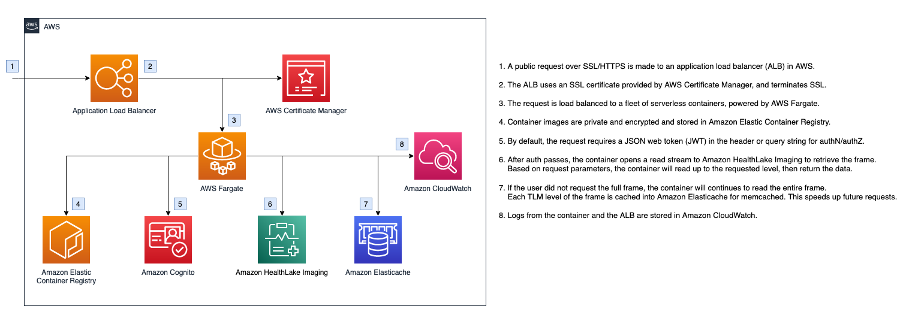

# AWS HealthImaging Tile Level Marker (TLM) Proxy

AWS HealthImaging compresses image frames losslessly using [High Throughput J2K (HTJ2K)](https://www.htj2k.com). HTJ2K enables you to decode and display a lossy, smaller resolutioned image by reading a portion of the original image frame. This gives you the ability to store only one copy of your imaging data. For example, thumnbnails can be generated dynamically by reading the first several kilobytes of the full image frame. Another example is to display lower resolutioned frame data in a stack for faster time to first image and time to first cine, then progressively increasing display resolution by reading more of the image frame.

Discrete segements in an HTJ2K-compressed image frame are bounded by tile level markers (TLM). The number of discrete levels, or decomposition levels, vary between frame to frame. After reading level 0, it is not necessary to reread from the beginning of the stream the next level. Rather, you can start reading from where level 0 ended, up to the desired level (or the end of the frame). Then you can append the newly-read data on top of the level 0 data.

This proxy allows you to retrieve image frames from Amazon Health Lake Imaging while specifying a start and end tile level marker. Processing and caching is done server-side and the client receives the requested TLM-bounded image data.

The deployment includes a containerized proxy running on [AWS Fargate](https://aws.amazon.com/fargate/), a serverless container engine. By default, two containers, each running 2 vCPU and 4GB of memory are deployed behind an [Application Load Balancer (ALB)](https://aws.amazon.com/elasticloadbalancing/application-load-balancer/) with an HTTPS endpoint. Authentication is provided by [Amazon Cognito](https://aws.amazon.com/cognito/) via a JSON web token (JWT).

- [AWS HealthImaging Tile Level Marker (TLM) Proxy](#aws-healthimaging-tile-level-marker-tlm-proxy)
  - [Architecture](#architecture)
  - [Deployment Requirements](#deployment-requirements)
  - [Deployment](#deployment)
  - [Use](#use)
  - [AuthN/AuthZ](#authnauthz)
  - [Service API](#service-api)
  - [Environment Variables](#environment-variables)
  - [Dependencies](#dependencies)
  - [FAQ](#faq)
  - [Cleanup](#cleanup)

## Architecture



## Deployment Requirements

-   [cdk](https://docs.aws.amazon.com/cdk/v2/guide/cli.html)
-   [Docker](https://www.docker.com/)

[AWS Cloud9](https://aws.amazon.com/cloud9/) has the requirement packages already installed and can be used to deploy this project from the cloud.

The following requirements for this solution can be found in [config.ts](config.ts).

-   `ACM_ARN`: this is the Amazon Resource Name (ARN) of an AWS Certificate Manager SSL certificate in your account. This is required to terminate SSL for [Application Load Balancer](https://aws.amazon.com/elasticloadbalancing/application-load-balancer/). Make sure this is in the same region as where you're deploying this solution.
-   `COGNITO_USER_POOL_ID`: this is the Cognito user pool ID that is used to verify the JWT at the container level. See the [AuthN/AuthZ](#authnauthz) section for more information. This can also be overriden by an environment variable.

## Deployment

1. Check out the project.
2. Change current directory to project directory: `cd tile-level-marker-proxy`.
3. If deploying for the first time, run `cdk bootstrap` to [bootstrap the environment](https://docs.aws.amazon.com/cdk/v2/guide/bootstrapping.html).
4. Run `npm install` to install dependencies.
5. Review the [deployment requirements](#deployment-requirements) and update parameters in [config.ts](config.ts).
6. Run `cdk deploy` from the project root to deploy directly to your AWS account. This may take a few minutes.
7. The deployment process will output the public URL of the Application Load Balancer (ALB). See the [use](#use) section for directions on consuming this URL.
8. If using SSL/HTTPS for the ALB, create a DNS CNAME record that points from the domain name of the `ACM_ARN` to the ALB URL.

## Use

The TLM proxy can be called at the URL generated by the CDK deployment. The proxy behaves the same way as the GetImageFrame call:

```
POST /datastore/<datastoreId>/imageSet/<imageSetId>/getImageFrame

Content-type: application/json

{
   "imageFrameInformation": {
      "imageFrameId": "<imageFrameId>"
   }
}
```

To retrieve the TLM level, specify the `startLevel` and `endLevel` query parameters.

-   If neither are specified, the full image frame is returned.
-   If `startLevel` is not specified, it is assumed to be 0.
-   If `endLevel` is not specified, it is assumed to be the end of the file.

If requesting TLM level 0 (first level) or the entire frame, the entire frame, along with the TLM levels, will be cached.

For example, to retrieve the first level of an image frame,

```
POST /datastore/<datastoreId>/imageSet/<imageSetId>/getImageFrame?startLevel=0&endLevel=0

Content-type: application/json

{
   "imageFrameInformation": {
      "imageFrameId": "<imageFrameId>"
   }
}
```

Note that you do not have to reread this level to continue loading the image to its full resolution. You can continue to request `startLevel=1&endLevel=1`, then append that to the level 0 data, to get the level 1 frame data. Or request `startLevel=1` , then append that to the level 0 data for the full image frame.

## AuthN/AuthZ

By default, the container in this application expects an Amazon Cognito JSON Web Token (JWT) to be passed in along with the request. The token should be passed in the header or as a query parameter using the key `token`.

This auth flow uses the [aws-jwt-verify](https://www.npmjs.com/package/aws-jwt-verify) library. The library can optionally be used with any OIDC-compatible IDP that signs JWTs with RS256, RS384, or RS512.

To disable security (**not** recommended), modify [config.ts](config.ts) and set `AUTH_MODE` to `'null'`. Note this will allow _anyone_ access to your image frames.

## Service API

The container uses [AWS SDK v2](https://github.com/aws/aws-sdk-js). The [service model JSON](tlm-proxy-container/service-models/medical-imaging.json) for AWS HealthImaging is imported and defined in [medical-imaging.js](tlm-proxy-container/medical-imaging.js). After the service is generally available, it is recommended to use the official SDK.

During the beta, the service region is hard-coded to us-east-1.

## Environment Variables

The following environment variables can be set on the container:

| Variable                  | Use                                              | Default                           |
| ------------------------- | ------------------------------------------------ | --------------------------------- |
| DEPLOY_REGION             | CDK deploy region                                | us-east-1                         |
| AUTH_MODE                 | Auth mode for client verification                | cognito_jwt                       |
| COGNITO_USER_POOL_ID      | Amazon Cognito user pool ID for JWT verification | Defined in [config.ts](config.ts) |
| COGNITO_CLIENT_ID         | Amazon Cognito client ID for JWT verification    | null                              |
| ENABLE_LOCAL_NODECACHE    | Enable local NodeJS cache                        | true                              |
| ENABLE_AMAZON_ELASTICACHE | Enable Amazon Elasticache                        | true                              |
| MEMCACHED_ADDRESS         | Address of remote memcached instance             | Set by CDK                        |

## Dependencies

### AWS

-   [AWS SDK v3 for AWS HealthImaging](https://www.npmjs.com/package/@aws-sdk/client-medical-imaging)
-   [aws-jwt-verify](https://www.npmjs.com/package/aws-jwt-verify)

### High Throughput J2K Decoder

-   [htj2k-js](https://github.com/PantelisGeorgiadis/htj2k-js)

### Backend Framework

-   [fastify](https://www.npmjs.com/package/fastify)
-   [@fastify-cors](https://www.npmjs.com/package/@fastify/cors)
-   [@fastify/auth](https://www.npmjs.com/package/@fastify/auth)

### Caching

-   [memcached](https://www.npmjs.com/package/memcached)
-   [node-cache](https://www.npmjs.com/package/node-cache)

### Logging

-   [loglevel](https://www.npmjs.com/package/loglevel)
-   [loglevel-plugin-prefix](https://www.npmjs.com/package/loglevel-plugin-prefix)

## FAQ

### Can I run this container without using Amazon CDK?

Yes. The container code is located in the [tlm-proxy-container](tlm-proxy-container/) subdirectory. For AuthZ and AuthN against AWS and the medical-imaging service, refer to the [AWS Identity and Access Management](https://docs.aws.amazon.com/IAM/latest/UserGuide/intro-structure.html) documentation.

### Can I run the container code on [AWS Lambda](https://aws.amazon.com/lambda/)?

AWS Lambda has a 6MB syncrhonous request and response payload limit. In cases where the TLM level returns larger than this limit, you will get an HTTP 413: Body Size is Too Large error. Additional work is needed to work around this (pagination, for example).

### Can I use [Amazon CloudFront](https://aws.amazon.com/cloudfront/) with this solution?

Yes, a CloudFront distribution can be created in front of the Application Load Balancer. Use the [AWS-managed prefix list](https://docs.aws.amazon.com/vpc/latest/userguide/working-with-aws-managed-prefix-lists.html) to configure the ALB security group to allow incoming connections from CloudFront.

### If I don't need TLM markers but want to use Amazon CloudFront, can I still use this?

This workload would be better served using Amazon CloudFront directly with [Lambda@Edge](https://aws.amazon.com/lambda/edge/). This will be provided in an upcoming project in this repository.

### Can I limit AWS Fargate containers' access to specific image frames?

Yes. The ECS task role function uses an execution policy that allows it access to get all image frames. You can customize the IAM policy in the [CDK stack](./lib/tile-level-marker-proxy-stack.ts) by applying access restrictions to the `medical-imaging:GetImageFrame` action for the `ecsTaskRole` role.

### Can I run the container using ARM64 architecture?

Yes. ARM64 can furthur reduce ECS Fargate costs. By default, CDK uses the current machine architecture to build the container. This sample project has been coded to use x86-64/AMD64 for compatibility reasons. To update the CDK project to use ARM64, update [tile-level-marker-proxy-stack.ts](./lib/tile-level-marker-proxy-stack.ts) and change the `DockerImageAsset` construct to use `platform: Platform.LINUX_ARM64` and the `FargateTaskDefinition` construct to use `cpuArchitecture: ecs.CpuArchitecture.ARM64`.

## Cleanup

To remove this app, run the following in the project directory:

`cdk destroy --all`
